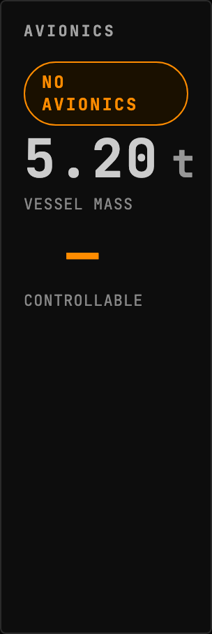
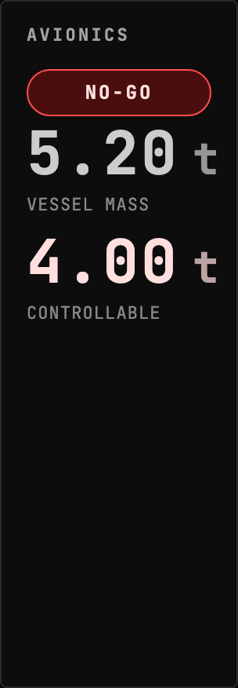
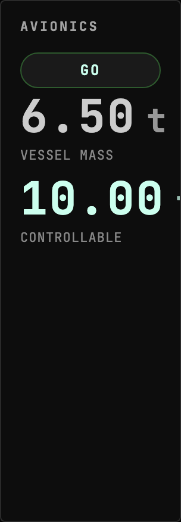

<!-- Generated by `gonogo-uplink docs`. Do not edit this file: it is written
     from the registrations, the contract slice and the fixtures. -->

# Avionics

Reports the active RP-1 avionics unit's tonnage limit against the vessel's mass.

| | |
| --- | --- |
| Uplink id | `avionics` |
| Version | `0.0.1` |
| Wraps | RP-1 4.5.0.0 (ckan) |
| Built against | contract 15.0, api 1.0.0, ui-kit 0.1.0 |

## Wire

| Topic | Payload | Delivery | Delay |
| --- | --- | --- | --- |
| `avionics.status` | `AvionicsStatus` | lossy-latest | delayed |
| `avionics.available` | – | lossy-latest | true-now |

## Widgets

### Avionics Control

RP-1 ascent controllability: is the vessel mass within the active avionics unit's tonnage limit.

| | |
| --- | --- |
| Widget id | `avionics-go-no-go` |
| Reads | `avionics.status` |
| Only while present | `flight` |
| Default size | 4 × 4 |
| Scenes | 3 |

