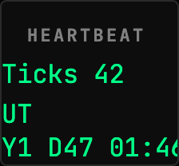
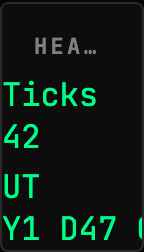
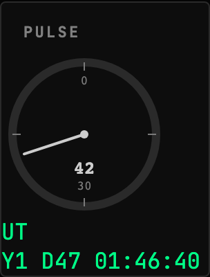
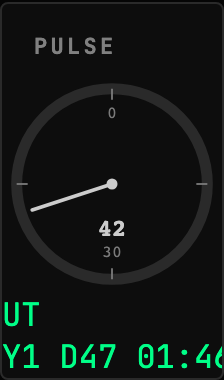
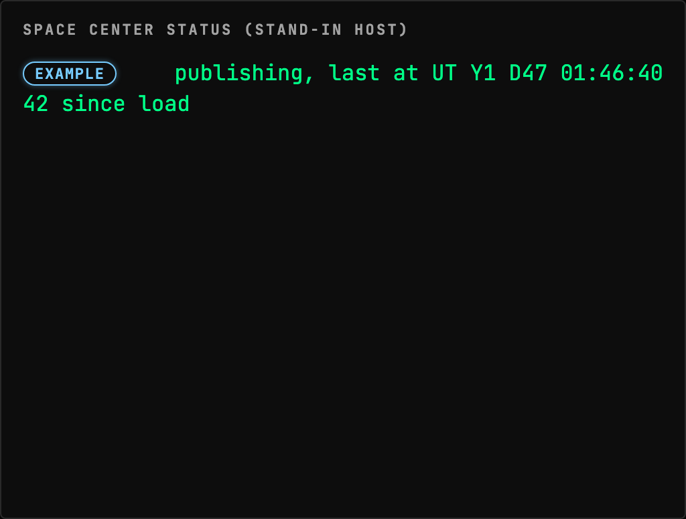

<!-- Generated by `gonogo-uplink docs`. Do not edit this file: it is written
     from the registrations, the contract slice and the fixtures. -->

# Example

The smallest Uplink that is still a real one: one KSP plugin, one channel, one widget, and no third-party mod to install. Copy this directory to start your own.

| | |
| --- | --- |
| Uplink id | `example` |
| Version | `0.0.1` |
| Built against | contract 15.0, api 1.0.0, ui-kit 0.1.0 |

## Wire

| Topic | Payload | Delivery | Delay |
| --- | --- | --- | --- |
| `example.heartbeat` | `ExampleHeartbeat` | lossy-latest | true-now |

## Widgets

### Heartbeat

The example Uplink's one channel: how many times it has published, and the universal time of the last sample.

| | |
| --- | --- |
| Widget id | `example-heartbeat` |
| Reads | `example.heartbeat` |
| Default size | 3 × 3 |
| Scenes | 1 |

### Pulse

The example Uplink's publish cadence on a dial: the needle sweeps once per sixty publishes and the centre carries the true total.

| | |
| --- | --- |
| Widget id | `example-pulse-dial` |
| Reads | `example.heartbeat` |
| Default size | 4 × 4 |
| Scenes | 1 |

## Augments

| Augment | Into | Reads | Presence | Scenes | Notes |
| --- | --- | --- | --- | --- | --- |
| `example-cadence-section` | `space-center-status.sections` | `example.heartbeat` | only while `example` | 1 |  |

## Contributions

| Contribution | Into | Computed from | Presence |
| --- | --- | --- | --- |
| `example:heartbeat-blob` | `system-view.entities` | `system.bodies`, `example.heartbeat` | only while `example` |

