<!-- Generated by `gonogo-uplink docs`. Do not edit this file: it is written
     from the registrations, the contract slice and the fixtures. -->

# Aerodynamics

Reports FAR's own aerodynamic state: angle of attack, sideslip, stall, lift and drag.

| | |
| --- | --- |
| Uplink id | `aero` |
| Version | `0.0.1` |
| Wraps | Ferram Aerospace Research 0.16.1.2 (ckan) |
| Built against | contract 17.0, api 2.0.0, ui-kit 0.1.0 |

## Wire

| Topic | Payload | Delivery | Delay |
| --- | --- | --- | --- |
| `aero.state` | `AeroState` | lossy-latest | delayed |
| `aero.available` | – | lossy-latest | true-now |

## Contributions

| Contribution | Into | Computed from | Presence |
| --- | --- | --- | --- |
| `aero:aero-state` | `plots` | `aero.state` | only while `aero` |
| `aero:descent-envelope` | `plots` | `aero.state`, `vessel.landing`, `vessel.flight`, `vessel.surface`, `vessel.identity`, `system.bodies` | only while `aero` |
| `aero:descent-envelope-badges` | `landing-status.badges` | `aero.state` | only while `aero` |

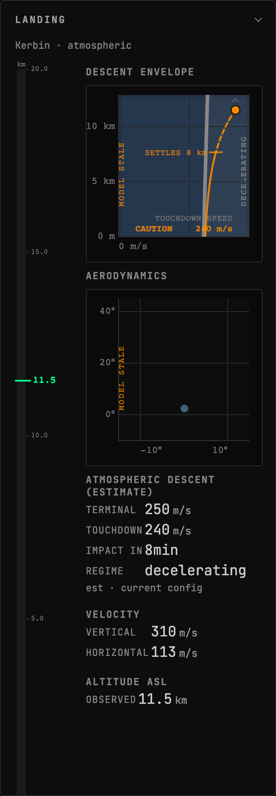

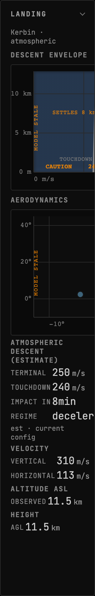

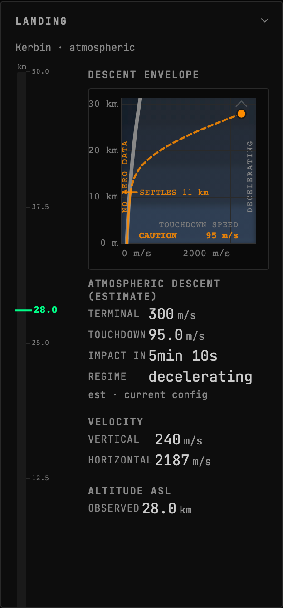

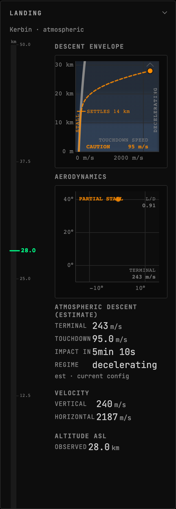

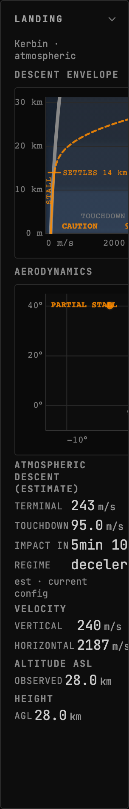

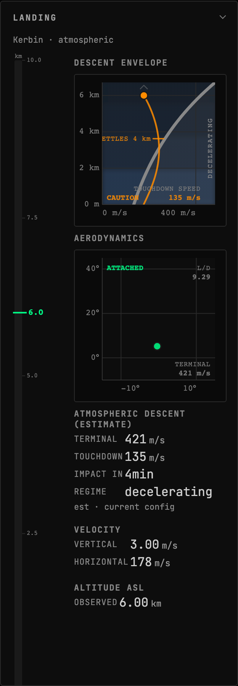

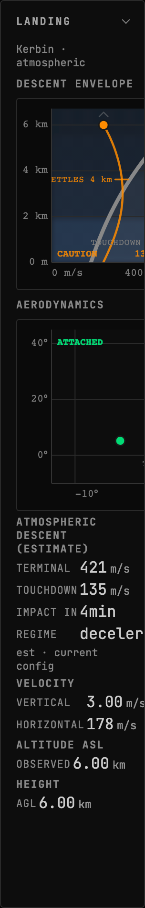

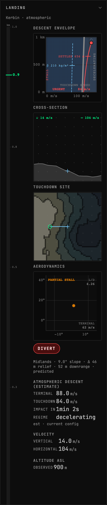

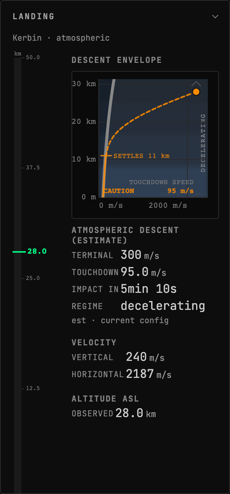

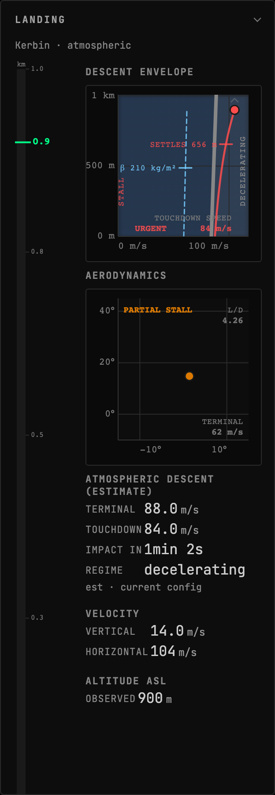

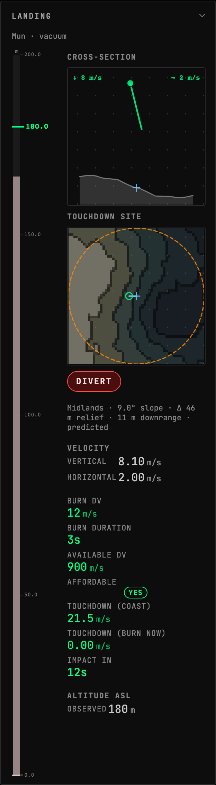

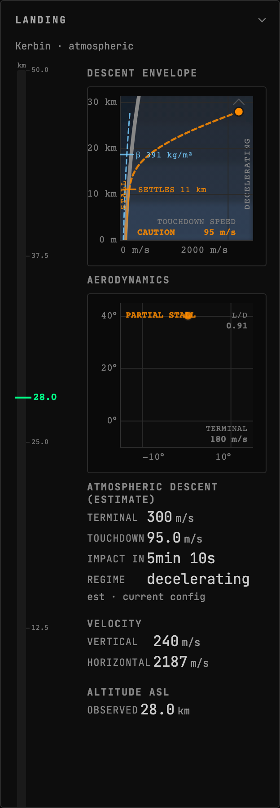

