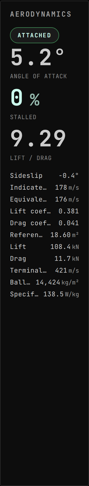
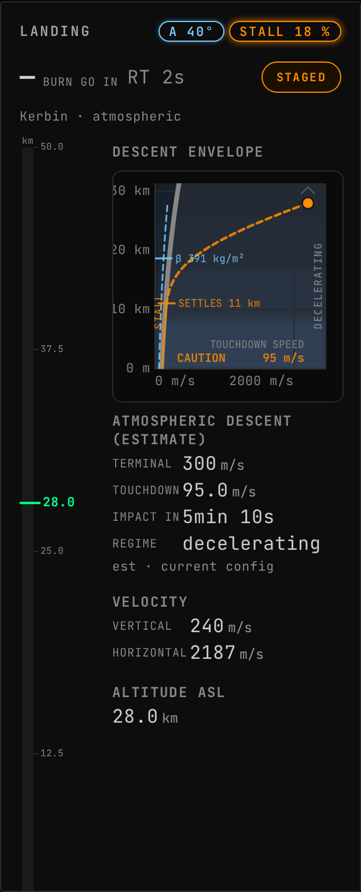

<!-- Generated by `uplink-tools docs` or `uplink-tools page`. Do not edit this file: it is written
     from the registrations, the contract slice and the fixtures. -->

# Aerodynamics

Puts Ferram Aerospace Research's own aerodynamic numbers on the board: angle of attack, sideslip, stall, lift and drag.

| | |
| --- | --- |
| Uplink id | `aero` |
| Version | `0.0.1` |
| Wraps | Ferram Aerospace Research 0.16.1.2 (ckan) |
| Built against | contract 36.0, extension API 6.0.0 |

## Wire

| Topic | Payload | Delivery | Delay |
| --- | --- | --- | --- |
| `aero.state` | `AeroState` | lossy-latest | delayed |
| `aero.available` | – | lossy-latest | true-now |

## Widgets

### Aerodynamics

Angle of attack, sideslip, stall fraction, lift, drag and dynamic pressure as Ferram Aerospace Research computes them. Shows that FAR is unavailable instead of zeros when it is not installed.

| | |
| --- | --- |
| Widget id | `aerodynamics` |
| Reads | `aero.state` |
| Needs | a vessel in flight |
| Default size | 4 × 7 |
| Smallest size | 4 × 5 |
| Scenes | 4 |

## Contributions

| Contribution | Into | Computed from | Presence |
| --- | --- | --- | --- |
| `aero:descent-envelope` | `plots` | `aero.state`, `vessel.landing`, `vessel.flight`, `vessel.surface`, `vessel.identity`, `system.bodies` | only while `aero` |
| `aero:descent-envelope-badges` | `landing-status.badges` | `aero.state` | only while `aero` |

