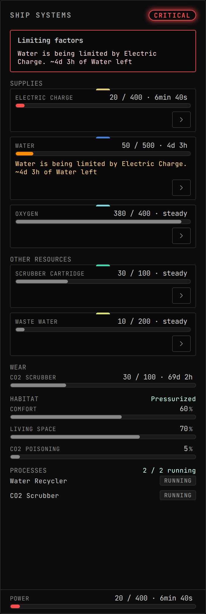
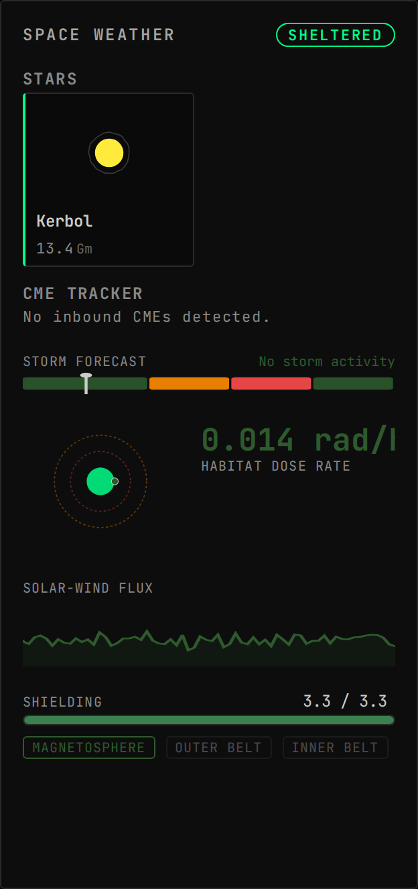
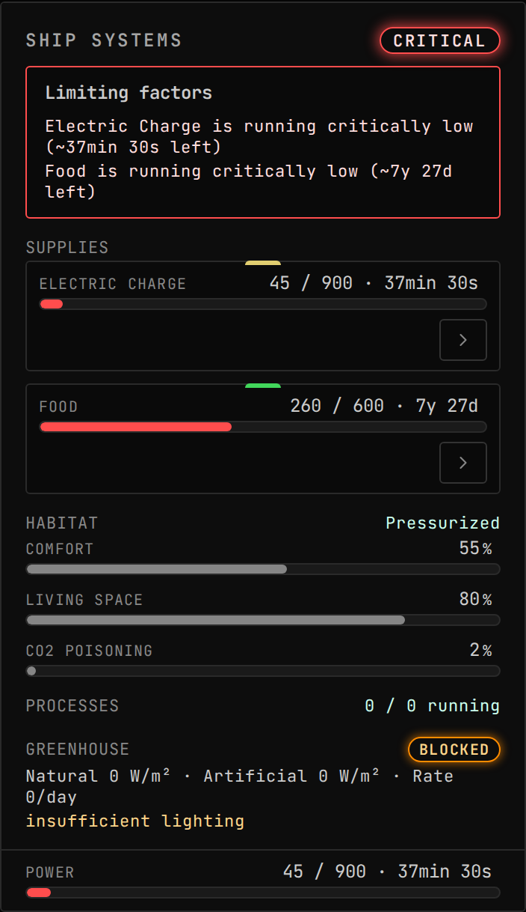
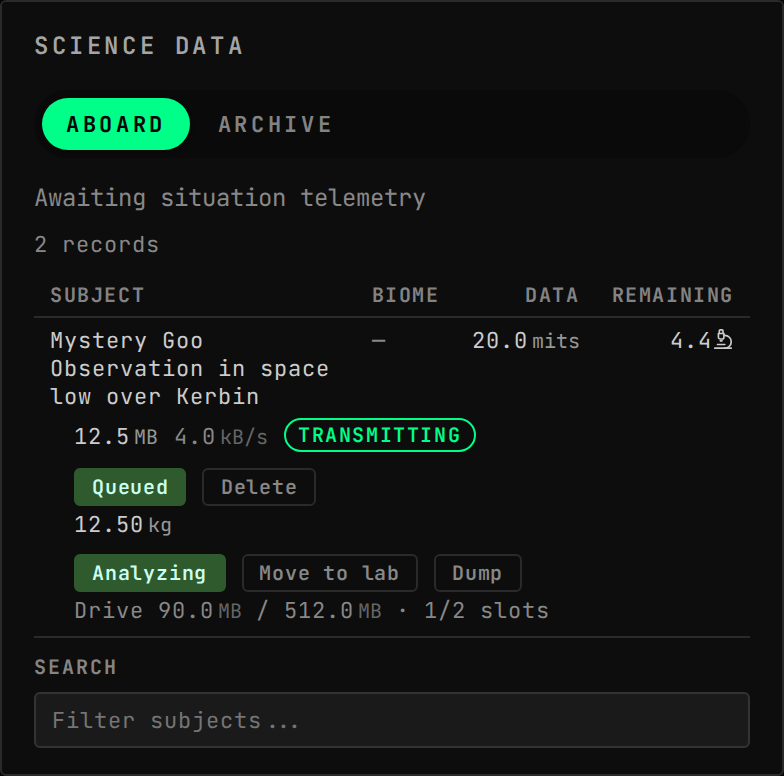
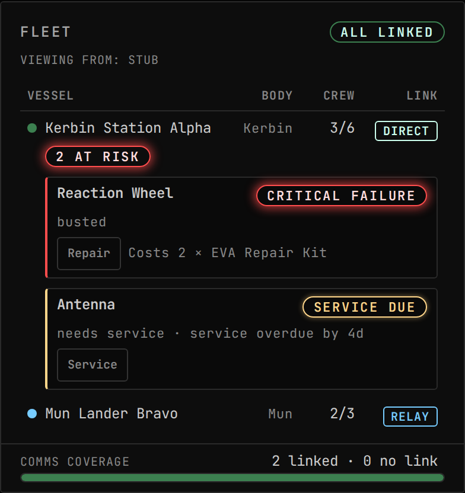
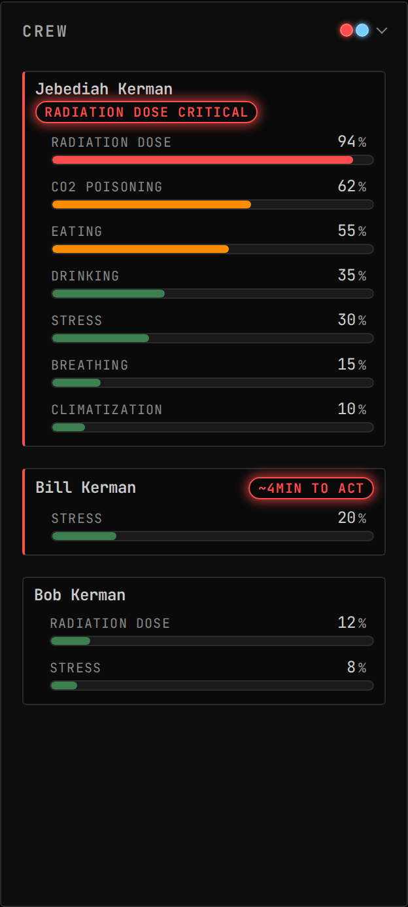
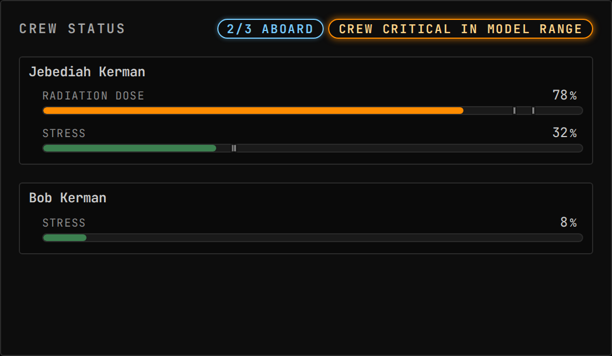
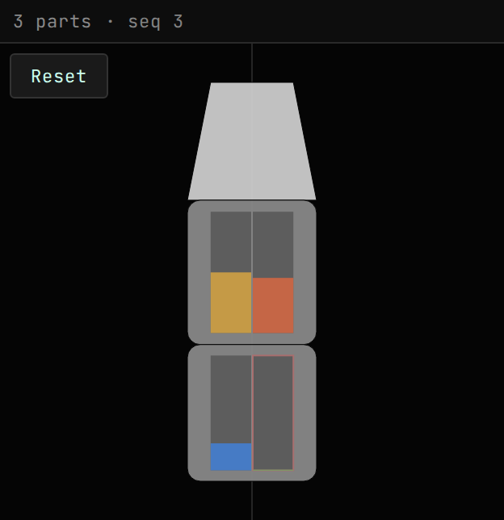
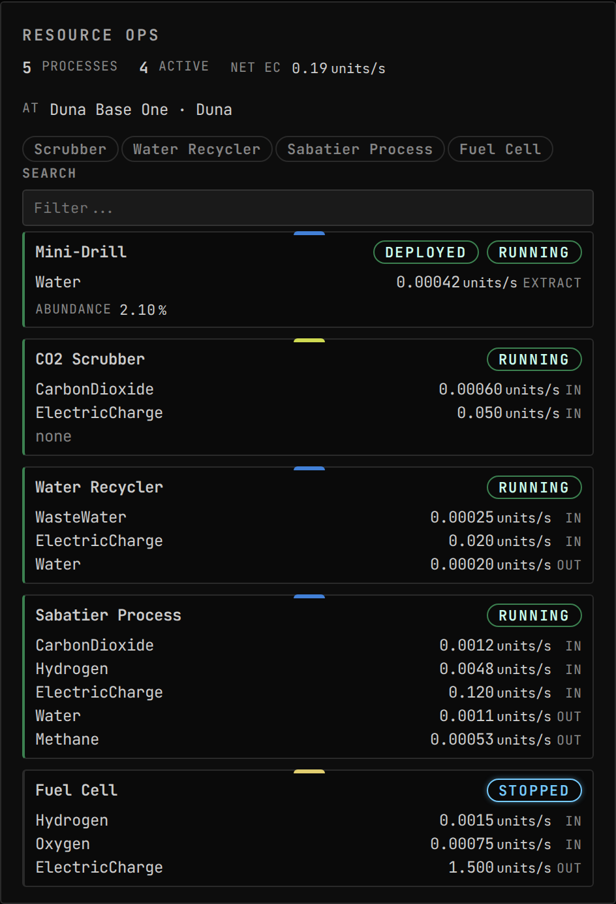

<!-- Generated by `uplink-tools docs`. Do not edit this file: it is written
     from the registrations, the contract slice and the fixtures. -->

# Kerbalism

Kerbalism life support as one ledger: every profile resource as a meter with the per-source rates that move it, plus wear, habitat, processes and power.

| | |
| --- | --- |
| Uplink id | `kerbalism` |
| Version | `0.0.1` |
| Wraps | Kerbalism 3.32 (ckan) |
| Built against | contract 29.22, extension API 6.0.0 |

## Wire

| Topic | Payload | Delivery | Delay |
| --- | --- | --- | --- |
| `kerbalism.crew` | `KerbalismCrewEntry[]` | lossy-latest | delayed |
| `kerbalism.features` | `KerbalismFeatures` | lossy-latest | true-now |
| `kerbalism.lifesupport` | `KerbalismLifeSupport` | lossy-latest | delayed |
| `kerbalism.profile` | `KerbalismProfile` | lossy-latest | true-now |
| `kerbalism.reliability` | `KerbalismReliabilitySummary` | lossy-latest | delayed |
| `kerbalism.reliabilityParts` | `KerbalismReliabilityPart[]` | lossy-latest | delayed |
| `kerbalism.spaceweather` | `KerbalismSpaceWeather` | lossy-latest | delayed |
| `kerbalism.available` | – | lossy-latest | true-now |

| Payload | Fields |
| --- | --- |
| `KerbalismCrewRule` | `degenPerSec` units/s, `fatalThreshold` units, `name` text, `problem` units |
| `KerbalismGreenhouseEntry` | `active` flag, `artificial` W/m², `cropResource` text, `ecRateMaxPerSec` units/s, `foodRatePerSec` units/s, `issue` text, `lampEcDrawPerSec` units/s, `lightToleranceWm2` W/m², `natural` W/m², `pressureTolerance` ratio, `radiationToleranceRadPerSec` rad/s |
| `KerbalismHabitat` | `comfort` ratio, `livingSpace` ratio, `poisoning` ratio, `pressure` ratio, `shielding` ratio, `surface` m², `volume` m³ |
| `KerbalismIsruConverterExtension` | `broken` flag, `capacity` units, `processToken` text, `title` text, `valveIndex` count |
| `KerbalismIsruDrillExtension` | `ecRate` units/s, `harvestType` text, `issue` text, `sourceMassRemaining` t, `sourceMassThreshold` t |
| `KerbalismProcessDef` | `dumpValves` text, `inputs` units/s, `modifiers` text, `name` text, `outputs` units/s |
| `KerbalismProcessEntry` | `broken` flag, `capacity` units, `envModifier` 1, `flightId` id, `resource` text, `running` flag, `title` text, `valveIndex` count |
| `KerbalismReliabilityBudget` | `consumed` ratio, `id` id, `kind` enum, `label` text, `limitSeconds` s, `usedSeconds` s |
| `KerbalismRepairCostItem` | `name` id, `quantity` count |
| `KerbalismRepairOutcome` | `kitsFrom` id, `kitsUsed` count, `repaired` flag |
| `KerbalismResource` | `amount` units, `capacity` units, `rate` units/s |
| `KerbalismResourceDef` | `density` kg/m³, `displayName` text, `flowMode` text, `flowModeOrdinal` enum, `isSupply` flag, `lowThreshold` ratio |
| `KerbalismRuleDef` | `breakdown` flag, `degeneration` units/s, `fatalThreshold` units, `input` text, `interval` s, `modifiers` text, `name` text, `output` text, `rate` units, `ratePerSecond` units/s |
| `KerbalismScienceBreakdownExt` | `percentCollectedTotal` ratio, `scienceCollectedInFlight` science, `scienceRemainingTotal` science, `timesCompleted` count |
| `KerbalismScienceExperimentExt` | `analyze` flag, `dataSizeMB` MB, `kind` id, `sampleMass` t, `sampleSlotsTotal` count, `sampleSlotsUsed` count, `sciencePerMB` science/MB, `sendFlagged` flag, `storageCapacityMB` MB, `storageUsedMB` MB, `transmitRateMBps` MB/s, `transmitting` flag |
| `KerbalismScienceInstrumentExt` | `bodyCoveragePercent` %, `dataRateMBps` MB/s, `ecRate` units/s, `expStatus` id, `issue` text, `kind` id, `powerDisabled` flag, `prodFactor` ratio, `remainingSampleMass` t, `runningState` id, `scanning` flag |
| `KerbalismScienceLabExt` | `analysisRateMBps` MB/s, `effectiveRateMBps` MB/s, `status` id |
| `KerbalismStarInfo` | `direction.x` 1, `direction.y` 1, `direction.z` 1, `distance` m, `star` text |
| `KerbalismStormEntry` | `dist` m, `star` text, `stormDuration` s, `stormState` count, `stormTime` ut, `targetKind` enum, `targetName` text |

## Commands

| Command | Args | Result |
| --- | --- | --- |
| `kerbalism.file.delete` | `KerbalismSubjectActionArgs` | `CommandResult` |
| `kerbalism.file.send` | `KerbalismSubjectFlagArgs` | `CommandResult` |
| `kerbalism.repair` | `KerbalismRepairPartArgs` | `CommandResultOf<KerbalismRepairOutcome>` |
| `kerbalism.sample.analyze` | `KerbalismSubjectFlagArgs` | `CommandResult` |
| `kerbalism.sample.dump` | `KerbalismSubjectActionArgs` | `CommandResult` |
| `kerbalism.sample.moveToLab` | `KerbalismSubjectActionArgs` | `CommandResult` |

| Args | Fields |
| --- | --- |
| `KerbalismRepairPartArgs` | `crewName` text, `partId` id |
| `KerbalismSubjectActionArgs` | `subjectId` id |
| `KerbalismSubjectFlagArgs` | `flag` flag, `subjectId` id |

## Widgets

### Ship Systems

Vessel-wide Kerbalism resource ledger: root-cause diagnosis, every profile resource as a meter with a per-source rate ledger, wear gauges, habitat, processes, and the power meter.

| | |
| --- | --- |
| Widget id | `ship-systems` |
| Reads | `kerbalism.profile`, `kerbalism.lifesupport`, `vessel.resources`, `vessel.crew` |
| Slots | `ship-systems.life-support` |
| Only while present | `flight` |
| Default size | 9 × 15 |
| Scenes | 4 |

### Space Weather

Sun vantage plus vessel exposure: a per-star activity diagram for every star this vessel sees and a CME tracker (departure, transit progress, impact ETA, and the named target, the body below or the vessel itself out in solar orbit), then the craft's own habitat dose rate, belt/magnetopause position rings and shielding.

| | |
| --- | --- |
| Widget id | `space-weather` |
| Reads | `kerbalism.spaceweather` |
| Uses if present | `vessel.flight` |
| Only while present | `flight` |
| Default size | 8 × 11 |
| Scenes | 8 |

## Augments

| Augment | Into | Reads | Presence | Scenes | Notes |
| --- | --- | --- | --- | --- | --- |
| `life-support-greenhouse` | `ship-systems.life-support` | – |  | 1 |  |
| `crew-status-radiation-summary` | `crew-status.summary` | – | only while `kerbalism` | 0 |  |
| `crew-status-survival-badge` | `crew-status.row-badges` | – | only while `kerbalism` | 0 |  |
| `science-data-aboard-row-file-manager` | `science-data.aboard-row` | – | only while `kerbalism` | 3 |  |
| `kerbalism-reliability-updates` | `fleet-roster.updates` | – | only while `kerbalism` | 2 |  |

## Contributions

| Contribution | Into | Computed from | Presence |
| --- | --- | --- | --- |
| `kerbalism:ship-systems-badge` | `ship-systems.badges` | `processor:kerbalism:ship-systems` | only while `flight` |
| `kerbalism:crew-survival-meters` | `crew-status.meters` | `processor:kerbalism:crew-survival`, `processor:kerbalism:crew-rule-readings` | only while `kerbalism` |
| `kerbalism:crew-survival-badge` | `crew-status.badges` | `processor:kerbalism:crew-survival` | only while `kerbalism` |
| `kerbalism:crew-survival-band-badge` | `crew-status.badges` | `processor:kerbalism:crew-rule-readings`, `processor:kerbalism:crew-survival` | only while `kerbalism` |
| `kerbalism:crew-survival-row-tone` | `crew-status.row-tone` | `processor:kerbalism:crew-survival` | only while `kerbalism` |
| `kerbalism:space-weather-badge` | `space-weather.badges` | `kerbalism.spaceweather` | only while `kerbalism` |
| `kerbalism:system-view-cme` | `system-view.entities` | `kerbalism.spaceweather` | only while `kerbalism` |
| `kerbalism:ship-map-part-meta` | `ship-map.part-meta` | `kerbalism.lifesupport` | only while `kerbalism` |
| `kerbalism:ship-map-part-meters` | `ship-map.part-meters` | `vessel.parts`, `processor:kerbalism:vessel-parts-reading`, `kerbalism.profile` | only while `kerbalism` |
| `kerbalism:resource-ops-processes` | `resource-ops.filters` | `isru.converters` | only while `kerbalism` |

## Models

| Kind | Id |
| --- | --- |
| processor | `kerbalism:ship-systems` |
| processor | `kerbalism:crew-survival` |
| processor | `kerbalism:crew-rule-readings` |
| processor | `kerbalism:vessel-parts-reading` |
| forward model | `kerbalism.crew` |
| forward model | `vessel.resources` |

## Error codes

| Code | Refines | Reads as | Meaning |
| --- | --- | --- | --- |
| `kerbalism.continuousScience` | `modeUnavailable` | Kerbalism runs and transmits experiments on its own | Kerbalism runs and transmits experiments continuously on its own, so a one-shot deploy or transmit has nothing to act on. |
| `kerbalism.scienceNotModelled` | `modeUnavailable` | Kerbalism is not modelling science here | Kerbalism is not modelling science on this vessel, so there is no file or sample to act on. |
| `kerbalism.noDriveSpace` | `limitReached` | no drive beside a lab has room for the whole sample | No drive beside a lab, other than the one holding it, has room for the whole sample. |
| `kerbalism.driveRefused` | `modeUnavailable` | the Kerbalism drive did not make the change | A Kerbalism drive was asked to change a file or sample and reported that it had not. |
| `kerbalism.noSuchCrew` | `notFound` | no crew member aboard has that name | Nobody aboard the craft answers to the name the repair was given. |
| `kerbalism.crewNotQualified` | `capabilityMismatch` | that kerbal does not meet Kerbalism's repair specs | The kerbal lacks the trait or experience level Kerbalism's repair specs ask for, which it raises by one level for a critical failure. |
| `kerbalism.evaImpossible` | `notClearToProceed` | the crew cannot get out to it yet | The kerbal cannot get out to the part: the hatch is inside a fairing, which clears once it is jettisoned. |
| `kerbalism.noKits` | `insufficientResource` | there are not enough repair kits aboard | The save requires repair kits and the kerbal and the craft's stores hold fewer than the repair takes. |
| `kerbalism.reliabilityNotModelled` | `modeUnavailable` | Kerbalism is not modelling part failures in this save | Kerbalism's reliability feature or its MTBF failures are switched off in this save, so no part is breaking. |
| `kerbalism.nothingToRepair` | `notFound` | no part aboard with that id is broken or due a service | No reliability module aboard has that id and is broken or due a service. |

