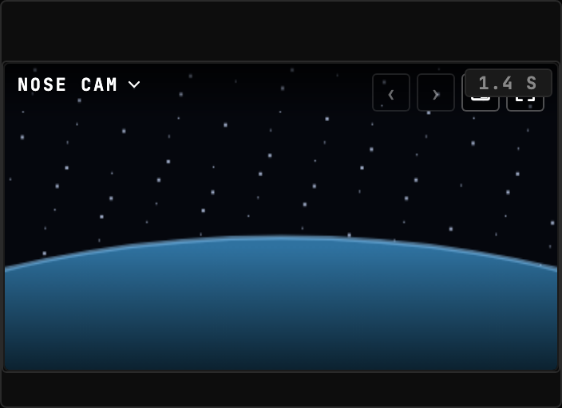
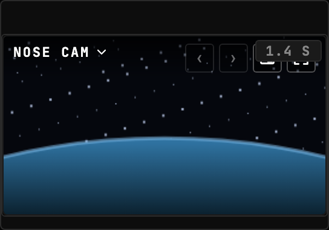
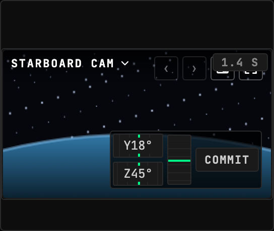

<!-- Generated by `gonogo-uplink docs`. Do not edit this file: it is written
     from the registrations, the contract slice and the fixtures. -->

# Kerbcast

Live in-flight camera views from Hullcam VDS parts, fed by the kerbcast sidecar. Aim and zoom ride the Uplink; the video stays on kerbcast's own WebRTC path.

| | |
| --- | --- |
| Uplink id | `kerbcast` |
| Version | `0.0.1` |
| Wraps | kerbcast 1.8.1 (manual) |
| Built against | contract 15.0, api 1.0.0, ui-kit 0.1.0 |

## Wire

| Topic | Payload | Delivery | Delay |
| --- | --- | --- | --- |
| `kerbcast.cameras` | `KerbcastCameraEntry[]` | lossy-latest | delayed |
| `kerbcast.available` | – | lossy-latest | true-now |

## Commands

| Command | Args | Result |
| --- | --- | --- |
| `kerbcast.setFieldOfView` | `KerbcastSetFieldOfViewArgs` | `CommandResult` |
| `kerbcast.setPan` | `KerbcastSetPanArgs` | `CommandResult` |

| Args | Fields |
| --- | --- |
| `KerbcastSetFieldOfViewArgs` | `cameraId` id, `fieldOfView` ° |
| `KerbcastSetPanArgs` | `cameraId` id, `pitch` °, `yaw` ° |

## Widgets

### Camera Feed

Live camera streams from in-flight Hullcam VDS parts, with an in-widget camera picker and Next/Previous switching.

| | |
| --- | --- |
| Widget id | `camera-feed` |
| Reads | `vessel.comms`, `comms.link`, `comms.delay` |
| Actions | `nextCamera`, `prevCamera`, `zoomIn`, `zoomOut`, `panYaw`, `panPitch` |
| Slots | `camera-feed.overlay` |
| Default size | 9 × 8 |
| Scenes | 3 |

![A camera that can be aimed, above the staged delay threshold: yaw and zoom stack beside a pitch wheel that is the same wheel turned a quarter turn, with the commit on the same line, in the picture's bottom-right corner. The kerbcast feed's own live pan pad and zoom pair have stood down for as long as this is up, so the corner they held is the corner this takes and there is only ever one control aiming the camera. The framing preview is no longer inside that cluster: it stands on its own at the bottom centre of the picture, where nothing clips the quad it deliberately draws outside the feed frame, and it appears on any picture whose centre line is clear of the control](docs/assets/camera-feed-steerable--default.png)

## Augments

| Augment | Into | Reads | Presence | Scenes | Notes |
| --- | --- | --- | --- | --- | --- |
| `kerbcast-crew-avatar` | `crew-status.avatar` | – | only while `kerbcast` | 0 |  |
| `kerbcast-docking-camera` | `targeting.camera` | `kerbcast.cameras` | only while `kerbcast` | 0 |  |

