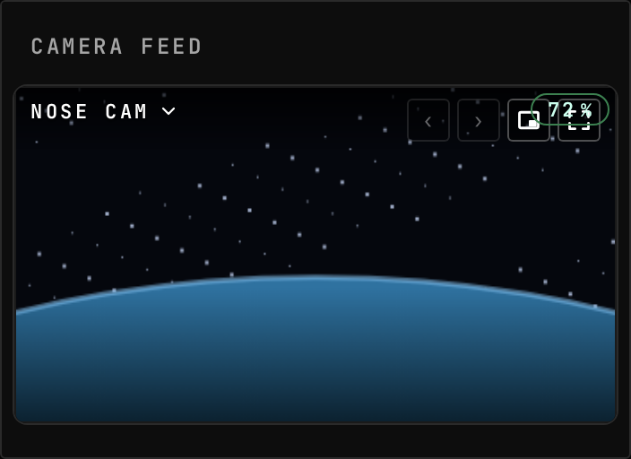
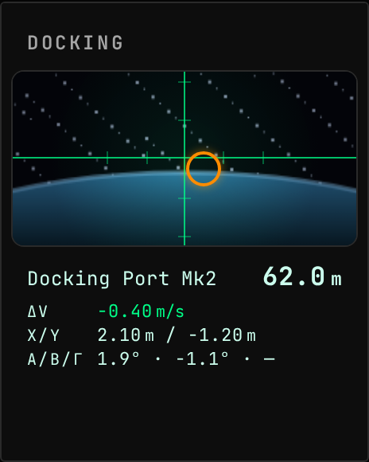

<!-- Generated by `gonogo-uplink docs`. Do not edit this file: it is written
     from the registrations, the contract slice and the fixtures. -->

# Kerbcast

Live in-flight camera views from Hullcam VDS parts, fed by the kerbcast sidecar. Aim and zoom ride the Uplink; the video stays on kerbcast's own WebRTC path.

| | |
| --- | --- |
| Uplink id | `kerbcast` |
| Version | `0.0.1` |
| Wraps | kerbcast 1.8.1 (ckan) |
| Built against | contract 27.8, api 6.0.0, ui-kit 0.1.0 |

## Wire

| Topic | Payload | Delivery | Delay |
| --- | --- | --- | --- |
| `kerbcast.cameras` | `KerbcastCameraEntry[]` | lossy-latest | delayed |
| `kerbcast.available` | – | lossy-latest | true-now |

## Commands

| Command | Args | Result |
| --- | --- | --- |
| `kerbcast.setFieldOfView` | `KerbcastSetFieldOfViewArgs` | `CommandResult` |
| `kerbcast.setPan` | `KerbcastSetPanArgs` | `CommandResult` |

| Args | Fields |
| --- | --- |
| `KerbcastSetFieldOfViewArgs` | `cameraId` id, `fieldOfView` ° |
| `KerbcastSetPanArgs` | `cameraId` id, `pitch` °, `yaw` ° |

## Widgets

### Camera Feed

Live camera streams from in-flight Hullcam VDS parts, with an in-widget camera picker and Next/Previous switching.

| | |
| --- | --- |
| Widget id | `camera-feed` |
| Reads | `vessel.comms`, `comms.link`, `comms.delay` |
| Actions | `nextCamera`, `prevCamera`, `zoomIn`, `zoomOut`, `panYaw`, `panPitch` |
| Slots | `camera-feed.overlay` |
| Default size | 9 × 8 |
| Scenes | 3 |

## Augments

| Augment | Into | Reads | Presence | Scenes | Notes |
| --- | --- | --- | --- | --- | --- |
| `kerbcast-crew-avatar` | `crew-status.avatar` | – | only while `kerbcast` | 0 |  |
| `kerbcast-docking-camera` | `targeting.camera` | `kerbcast.cameras` | only while `kerbcast` | 1 |  |

