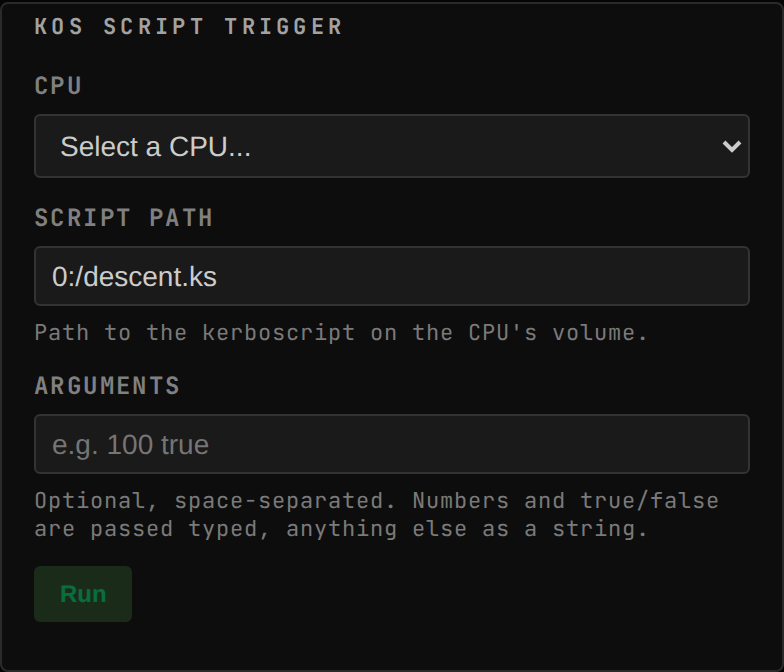
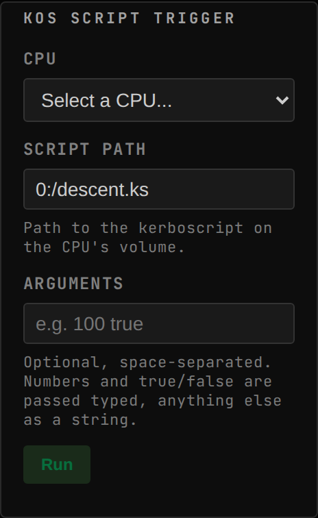
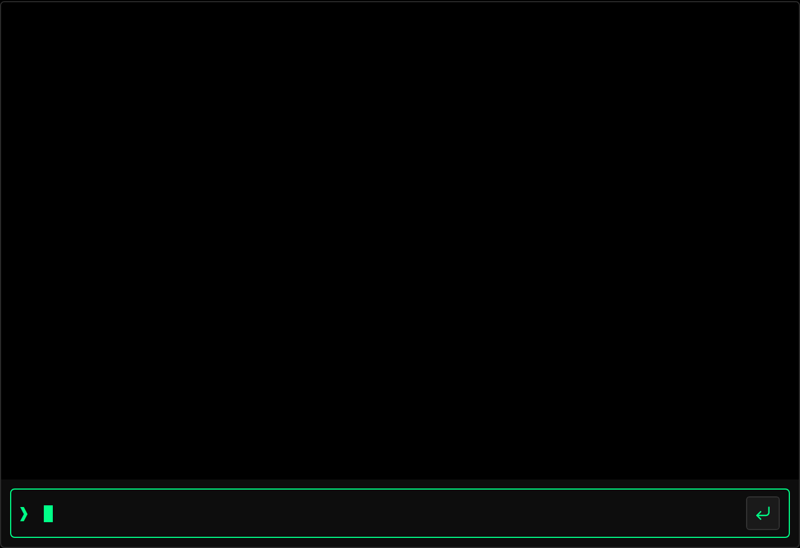
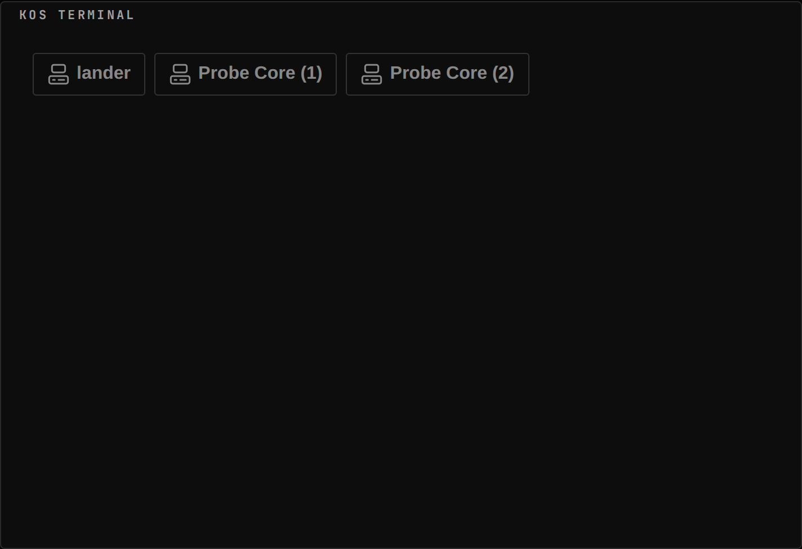
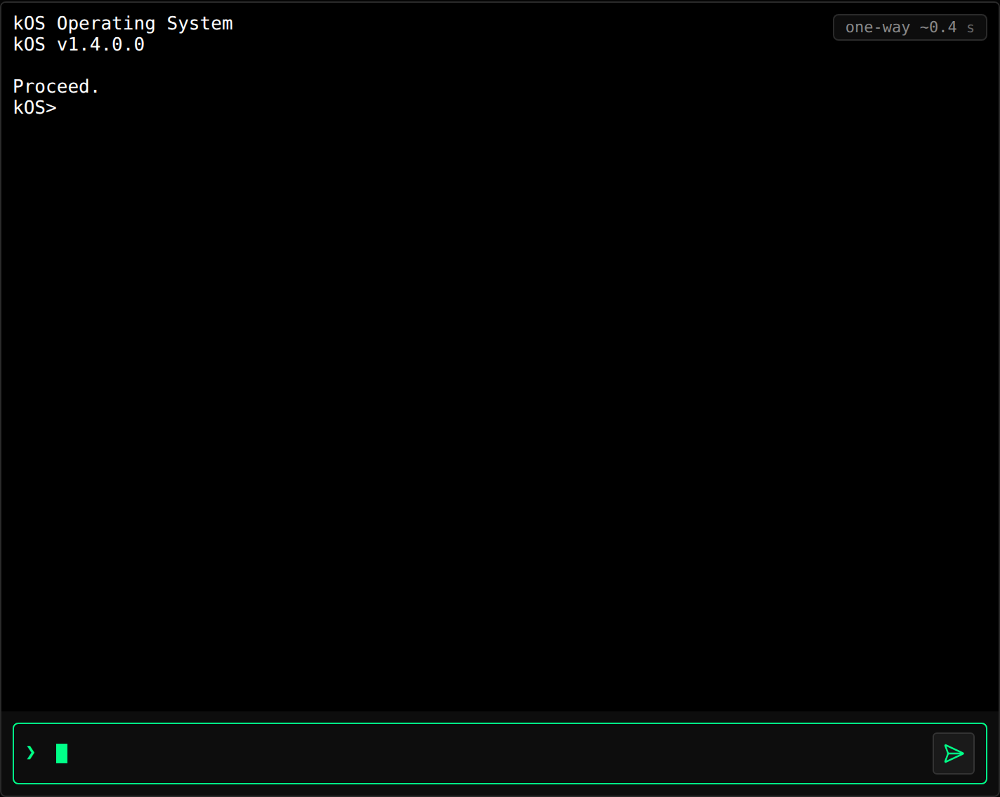

<!-- Generated by `gonogo-uplink docs`. Do not edit this file: it is written
     from the registrations, the contract slice and the fixtures. -->

# kOS

Puts a kOS CPU's real terminal on the dashboard, streamed in process with no proxy to run, and dispatches kerboscripts to a chosen CPU.

| | |
| --- | --- |
| Uplink id | `kos` |
| Version | `0.0.1` |
| Built against | contract 15.0, api 1.0.0, ui-kit 0.1.0 |

## Wire

| Topic | Payload | Delivery | Delay |
| --- | --- | --- | --- |
| `kos.processors` | `KosProcessorInfo[]` | lossy-latest | delayed |

| Payload | Fields |
| --- | --- |
| `KosComputeStatus` | `lastGoodAt` ut, `parseError` text, `paused` flag, `running` flag, `scriptError` text |
| `KosRunResult` | `coreId` id, `error` text, `requestId` id |
| `KosTerminalFrame` | `chunk` text, `coreId` id, `fullRepaint` flag |

## Commands

| Command | Args | Result |
| --- | --- | --- |
| `kos.keystroke` | `KosKeystrokeArgs` | `CommandResult` |
| `kos.run` | `KosRunArgs` | `CommandResult` |
| `kos.terminal.close` | `KosTerminalCloseArgs` | `CommandResult` |
| `kos.terminal.open` | `KosTerminalOpenArgs` | `CommandResult` |
| `kos.terminal.resize` | `KosTerminalResizeArgs` | `CommandResult` |

| Args | Fields |
| --- | --- |
| `KosKeystrokeArgs` | `chars` text, `coreId` id, `leaseToken` id |
| `KosRunArgs` | `command` text, `coreId` id, `requestId` id |
| `KosTerminalCloseArgs` | `coreId` id, `leaseToken` id |
| `KosTerminalOpenArgs` | `coreId` id, `leaseToken` id |
| `KosTerminalResizeArgs` | `cols` count, `coreId` id, `leaseToken` id, `rows` count |

## Widgets

### kOS Script Trigger

Run a kerboscript on a kOS CPU: pick the CPU, path, and args, dispatch over the Uplink, and see the correlated result or error inline.

| | |
| --- | --- |
| Widget id | `kos-script-trigger` |
| Reads | `kos.processors` |
| Default size | 10 × 9 |
| Scenes | 1 |

### kOS Terminal

Interactive or read-only terminal for a kOS CPU, streamed in-process over the Uplink (no proxy).

| | |
| --- | --- |
| Widget id | `kos-terminal` |
| Reads | `kos.processors` |
| Default size | 18 × 15 |
| Scenes | 3 |

