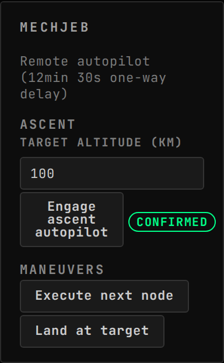
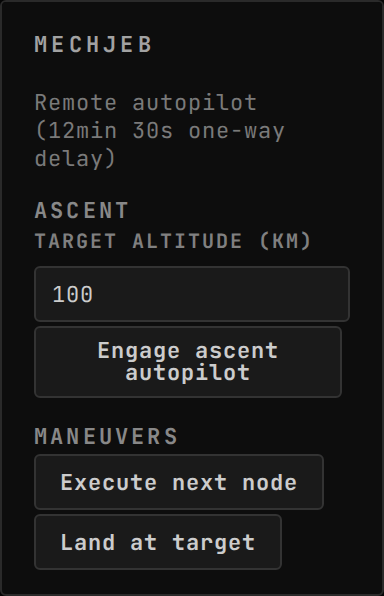
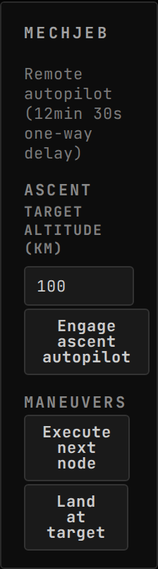
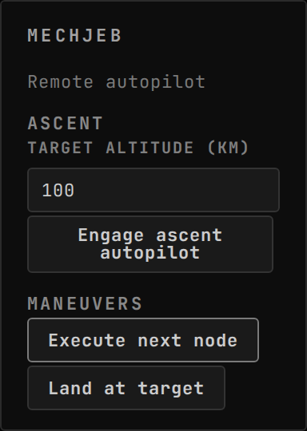
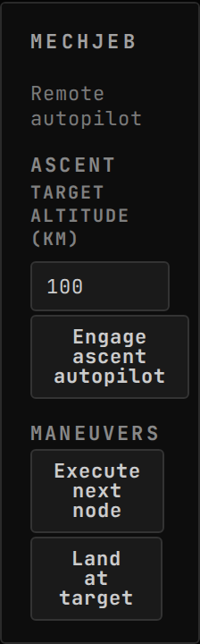

<!-- Generated by `gonogo-uplink docs`. Do not edit this file: it is written
     from the registrations, the contract slice and the fixtures. -->

# MechJeb

Flies the vessel from the console: engage MechJeb's ascent autopilot, execute the next node, or land at the selected target, over the delayed command path.

| | |
| --- | --- |
| Uplink id | `mechjeb` |
| Version | `0.0.1` |
| Wraps | MechJeb2 2.15.3.0 (ckan) |
| Built against | contract 18.12, api 3.0.0, ui-kit 0.1.0 |

## Wire

## Commands

| Command | Args | Result |
| --- | --- | --- |
| `mechjeb.engageAscentAutopilot` | `MechJebAscentArgs` | `CommandResult` |
| `mechjeb.executeNextNode` | `MechJebNoArgs` | `CommandResult` |
| `mechjeb.landAtTarget` | `MechJebNoArgs` | `CommandResult` |

| Args | Fields |
| --- | --- |
| `MechJebAscentArgs` | `targetAltitudeKm` km |
| `MechJebNoArgs` | – |

## Widgets

### MechJeb

Remote MechJeb autopilot control (engage ascent, execute next node, land at target) dispatched over the delayed-command path with per-command in-flight state.

| | |
| --- | --- |
| Widget id | `mechjeb` |
| Reads | `comms.delay` |
| Actions | `engage-ascent`, `execute-node`, `land-at-target` |
| Only while present | `flight` |
| Default size | 5 × 7 |
| Scenes | 3 |

