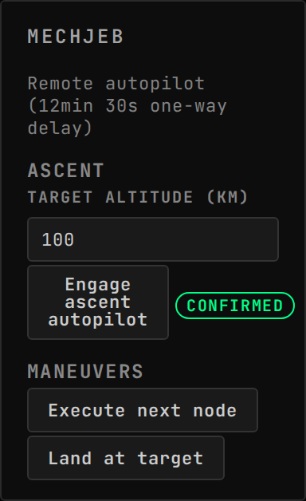

<!-- Generated by `uplink-tools docs` or `uplink-tools page`. Do not edit this file: it is written
     from the registrations, the contract slice and the fixtures. -->

# MechJeb

Flies the vessel from the console: engage MechJeb's ascent autopilot, execute the next node, or land at the selected target, over the delayed command path.

| | |
| --- | --- |
| Uplink id | `mechjeb` |
| Version | `0.0.1` |
| Wraps | MechJeb2 2.15.3.0 (ckan) |
| Built against | contract 36.0, extension API 6.0.0 |

## Wire

## Commands

| Command | Args | Result |
| --- | --- | --- |
| `mechjeb.engageAscentAutopilot` | `MechJebAscentArgs` | `CommandResult` |
| `mechjeb.executeNextNode` | `MechJebNoArgs` | `CommandResult` |
| `mechjeb.landAtTarget` | `MechJebNoArgs` | `CommandResult` |

| Args | Fields |
| --- | --- |
| `MechJebAscentArgs` | `targetAltitudeKm` km |
| `MechJebNoArgs` | – |

## Widgets

### MechJeb

Engage MechJeb's ascent autopilot, execute the next node, or land at the target. Shows the one-way light time each command costs and which commands are still in flight.

| | |
| --- | --- |
| Widget id | `mechjeb` |
| Reads, as flat keys | `comms.delay` |
| Actions to bind | Engage ascent autopilot (`engage-ascent`), Execute next node (`execute-node`), Land at target (`land-at-target`) |
| Needs | a vessel in flight |
| Default size | 5 × 7 |
| Smallest size | 3 × 5 |
| Scenes | 3 |

