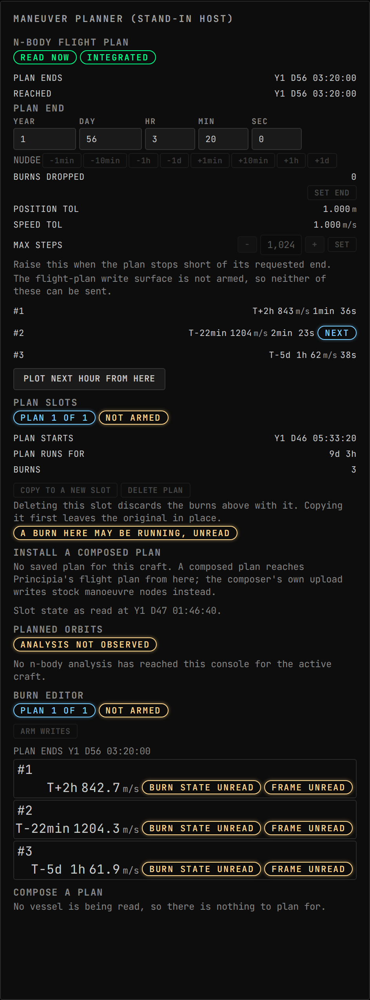
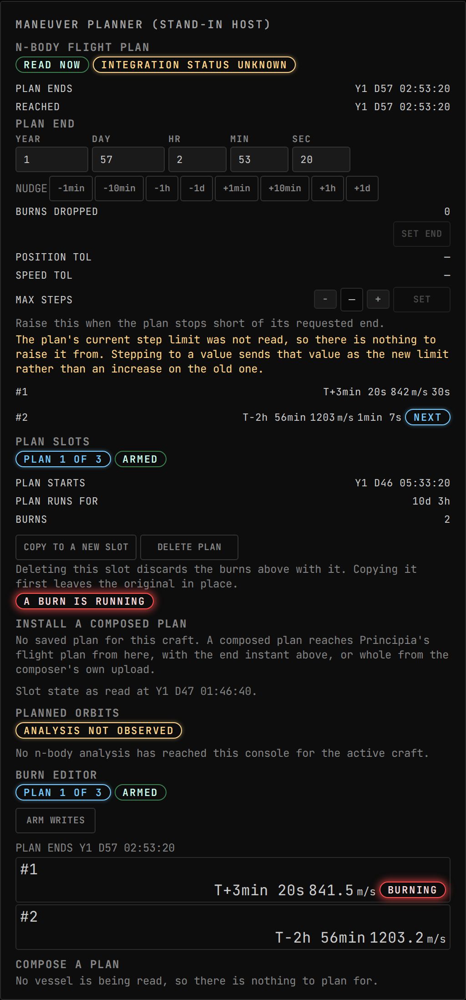
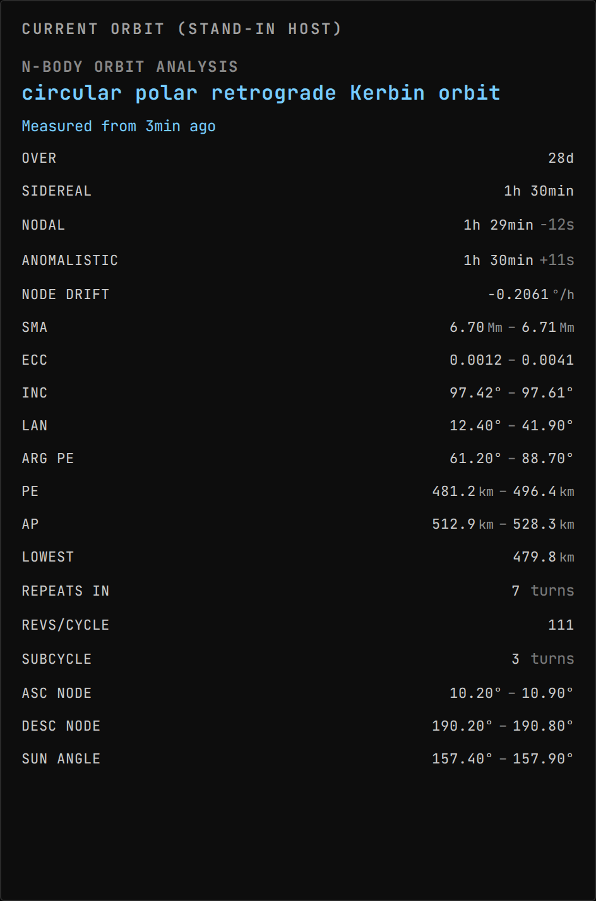
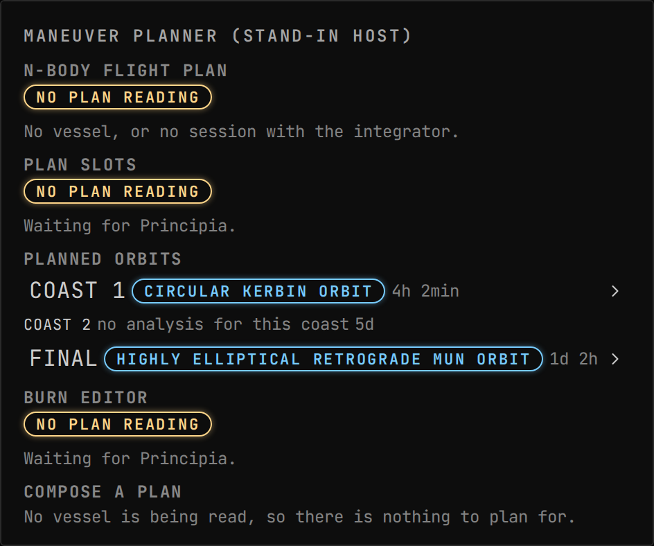
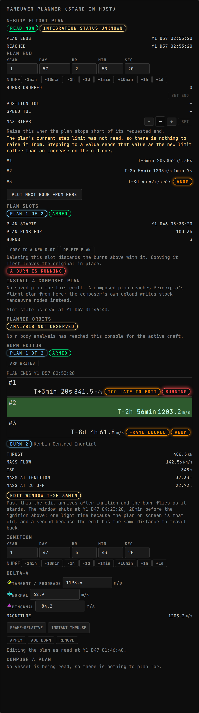
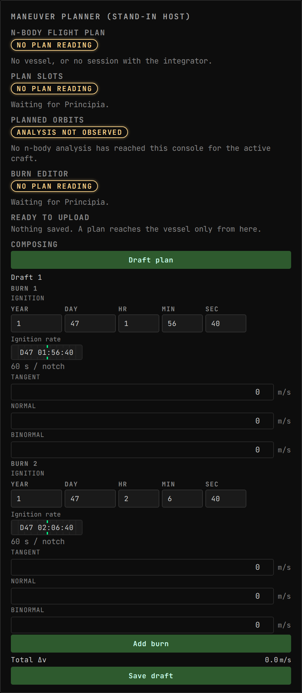

<!-- Generated by `gonogo-uplink docs`. Do not edit this file: it is written
     from the registrations, the contract slice and the fixtures. -->

# Principia

Publishes Principia's n-body state: how far each trajectory holds, the flight plan and its burns, the reference frame they are expressed in, and the integrator settings.

| | |
| --- | --- |
| Uplink id | `principia` |
| Version | `0.0.1` |
| Wraps | Principia 2026081218-Levi-Civita (manual) |
| Built against | contract 29.7, api 6.0.0, ui-kit 0.1.0 |

## Wire

| Topic | Payload | Delivery | Delay |
| --- | --- | --- | --- |
| `principia.analysis` | `PrincipiaAnalysis` | lossy-latest | delayed |
| `principia.plan` | `PrincipiaPlan` | lossy-latest | delayed |
| `principia.settings` | `PrincipiaSettings` | lossy-latest | true-now |

| Payload | Fields |
| --- | --- |
| `PrincipiaAngleInterval` | `max` °, `min` ° |
| `PrincipiaCoastAnalysis` | `analysis` PrincipiaOrbitAnalysis, `endsAtUt` ut, `index` count, `startsAtUt` ut |
| `PrincipiaComposedBurn` | `deltaVBinormal` m/s, `deltaVNormal` m/s, `deltaVTangent` m/s, `ignitionUt` ut, `inertiallyFixed` flag |
| `PrincipiaLengthInterval` | `max` m, `min` m |
| `PrincipiaOrbitAnalysis` | `anomalisticPeriodSeconds` s, `ascendingCrossingDegrees` PrincipiaAngleInterval, `ascendingNodeSolarTimeDegrees` PrincipiaAngleInterval, `descendingCrossingDegrees` PrincipiaAngleInterval, `descendingNodeSolarTimeDegrees` PrincipiaAngleInterval, `elementsEpochUt` ut, `elementsPresent` flag, `firstCollisionRiskUt` ut, `firstCollisionUt` ut, `firstReentryUt` ut, `gravitationallyBound` flag, `lowestAltitudeMetres` m, `meanApoapsisAltitudeMetres` PrincipiaLengthInterval, `meanArgumentOfPeriapsisDegrees` PrincipiaAngleInterval, `meanEccentricity` PrincipiaRatioInterval, `meanInclinationDegrees` PrincipiaAngleInterval, `meanLongitudeOfAscendingNodeDegrees` PrincipiaAngleInterval, `meanPeriapsisAltitudeMetres` PrincipiaLengthInterval, `meanSemimajorAxisMetres` PrincipiaLengthInterval, `missionDurationSeconds` s, `nodalPeriodSeconds` s, `nodalPrecessionDegreesPerHour` °/h, `primaryBody` text, `primaryIndex` count, `progressOfNextAnalysis` ratio, `recurrenceCycleRotations` count, `recurrenceEquatorialShiftDegrees` °, `recurrenceGridIntervalDegrees` °, `recurrenceRevolutions` count, `recurrenceRevolutionsPerRotation` count, `recurrenceSubcycleRotations` count, `siderealPeriodSeconds` s |
| `PrincipiaPlanIntegrator` | `generalizedIntegratorKind` enum, `integratorKind` enum, `lengthToleranceMetres` m, `maxSteps` count, `speedToleranceMetresPerSecond` m/s |
| `PrincipiaPlannedBurn` | `anomalous` flag, `centreBody` text, `coordinateSystem` enum, `cutoffUt` ut, `deltaV` m/s, `deltaVBinormal` m/s, `deltaVNormal` m/s, `deltaVTangent` m/s, `durationSeconds` s, `executing` flag, `finalMassTons` t, `frameEditable` flag, `frameType` enum, `ignitionUt` ut, `index` count, `inertiallyFixed` flag, `initialMassTons` t, `massFlowKilogramsPerSecond` kg/s, `primaryBodies` text, `primaryBody` text, `secondaryBodies` text, `secondaryBody` text, `specificImpulseSeconds` isp, `thrustKilonewtons` kN, `timeToHalfDeltaVSeconds` s |
| `PrincipiaPlanWriteReceipt` | `plan` PrincipiaPlan, `refusal` id, `refusalDetail` text, `replayed` flag, `requestId` id, `statusError` enum, `statusMessage` text |
| `PrincipiaRatioInterval` | `max` 1, `min` 1 |
| `PrincipiaReferenceFrame` | `centreBody` text, `primaryBodies` text, `primaryBody` text, `secondaryBodies` text, `secondaryBody` text, `selector` text, `targetFrameSelected` flag, `targetPrimaryBody` text, `targetVesselId` id, `targetVesselName` text, `type` enum |
| `PrincipiaWriteSurface` | `analysedVersion` text, `armed` flag, `available` flag, `burnLayoutVerified` flag, `detectedVersion` text, `integratorLayoutVerified` flag, `reason` text |

## Commands

| Command | Args | Result |
| --- | --- | --- |
| `principia.plan.arm` | `PrincipiaPlanArmArgs` | `CommandResultOf<Record<string, unknown>>` |
| `principia.plan.burn.insert` | `PrincipiaBurnEditArgs` | `CommandResultOf<Record<string, unknown>>` |
| `principia.plan.burn.remove` | `PrincipiaBurnRemoveArgs` | `CommandResultOf<Record<string, unknown>>` |
| `principia.plan.burn.replace` | `PrincipiaBurnEditArgs` | `CommandResultOf<Record<string, unknown>>` |
| `principia.plan.create` | `PrincipiaPlanSlotArgs` | `CommandResultOf<Record<string, unknown>>` |
| `principia.plan.delete` | `PrincipiaPlanSlotArgs` | `CommandResultOf<Record<string, unknown>>` |
| `principia.plan.duplicate` | `PrincipiaPlanSlotArgs` | `CommandResultOf<Record<string, unknown>>` |
| `principia.plan.horizon` | `PrincipiaPlanHorizonArgs` | `CommandResultOf<Record<string, unknown>>` |
| `principia.plan.integrator` | `PrincipiaPlanIntegratorArgs` | `CommandResultOf<Record<string, unknown>>` |
| `principia.plan.send` | `PrincipiaPlanSendArgs` | `CommandResultOf<Record<string, unknown>>` |

| Args | Fields |
| --- | --- |
| `PrincipiaBurnEditArgs` | `burnIndex` count, `deltaVBinormal` m/s, `deltaVNormal` m/s, `deltaVTangent` m/s, `ignitionUt` ut, `inertiallyFixed` flag, `requestId` id, `vesselId` id |
| `PrincipiaBurnRemoveArgs` | `burnIndex` count, `requestId` id, `vesselId` id |
| `PrincipiaPlanArmArgs` | `requestId` id, `vesselId` id |
| `PrincipiaPlanHorizonArgs` | `desiredFinalTimeUt` ut, `requestId` id, `vesselId` id |
| `PrincipiaPlanIntegratorArgs` | `lengthToleranceMetres` m, `maxSteps` count, `requestId` id, `speedToleranceMetresPerSecond` m/s, `vesselId` id |
| `PrincipiaPlanSendArgs` | `burns` PrincipiaComposedBurn[], `composedAtViewUt` ut, `desiredFinalTimeUt` ut, `observedAtUt` ut, `requestId` id, `vesselId` id |
| `PrincipiaPlanSlotArgs` | `finalTimeUt` ut, `requestId` id, `vesselId` id |

## Augments

| Augment | Into | Reads | Presence | Scenes | Notes |
| --- | --- | --- | --- | --- | --- |
| `principia-flight-plan` | `maneuver-planner.sections` | – |  | 6 |  |
| `principia-plan-slots` | `maneuver-planner.sections` | – |  | 3 |  |
| `principia-orbit-analysis` | `current-orbit.sections` | – |  | 5 |  |
| `principia-coast-analysis` | `maneuver-planner.sections` | – |  | 3 |  |
| `principia-burn-editor` | `maneuver-planner.sections` | – |  | 3 |  |
| `principia-plan-composer` | `maneuver-planner.sections` | – |  | 5 |  |

## Error codes

| Code | Refines | Reads as | Meaning |
| --- | --- | --- | --- |
| `principia.surfaceUnavailable` | `modeUnavailable` | Principia's plan surface is not available | No plugin, no session, or a producer build whose write entry points were never analysed. Writes fail closed to read-only. |
| `principia.notArmed` | `notClearToProceed` | plan writes are not armed | The surface was not armed. Every plan write changes the player's saved game and re-integrates on the game's own thread, so it takes a deliberate arm first. |
| `principia.layoutUnverified` | `modeUnavailable` | this Principia build's plan layout is not verified | The struct this write passes to the plugin failed its round-trip probe, or the probe has not run. A stale shape does not fail to resolve: it writes a plausible wrong burn into the save. |
| `principia.vesselUnknown` | `noVessel` | Principia does not know this vessel | The plugin no longer knows this vessel. |
| `principia.noFlightPlan` | `wrongState` | the vessel has no flight plan | The vessel holds no flight plan to edit. |
| `principia.planAlreadyExists` | `wrongState` | the vessel already has a flight plan | A plan already exists and this write would have created a second without being asked to. |
| `principia.planSlotsFull` | `limitReached` | the vessel already holds ten flight plans | The vessel already holds the producer's maximum of ten plans. An eleventh makes the producer's own planner window throw on every layout pass, permanently, with the button that would delete it inside the part that stopped rendering. |
| `principia.burnIndexOutOfRange` | `notFound` | the plan has no burn at that position | The burn index was outside the count read in the same frame. |
| `principia.burnExecuting` | `notClearToProceed` | that burn is executing | The burn is running right now. The plugin permits this and only the rebase entry point checks, so the guard is ours. |
| `principia.burnFrameUnsupported` | `capabilityMismatch` | Principia cannot take that burn's frame back | The burn's manœuvring frame is one the producer's frame factory does not handle, so sending the burn back would abort the game. |
| `principia.optimisationRunning` | `notClearToProceed` | an optimisation is running on the plan | An optimisation is running on this plan and would revert the edit without reporting it. |
| `principia.valueNotFinite` | `range` | a value was not a finite number | A requested value was not finite, or a Δv triple would have been. |
| `principia.thrustNotPositive` | `range` | the thrust is not positive | Thrust is not positive. A zero-thrust burn has infinite duration, which the producer's own singularity test does not catch: it pushes the plan's end instant to infinity, spawns a thread that never terminates, and serialises the infinity into the save. |
| `principia.integratorKindUnexpected` | `modeUnavailable` | the plan's integrators are not a pair this Uplink expects | The integrator kinds read back from the plugin were not the pair this build expects, so writing them back could abort with no message. The read succeeded, so this is neither unreadable nor a craft's capability. |
| `principia.integratorBoundsExceeded` | `range` | an integrator bound is outside what Principia offers | A requested integrator bound was outside the range the producer's own controls offer. |
| `principia.finalTimeInPast` | `range` | the plan would end before it starts | A plan cannot be created ending before it starts. |
| `principia.pluginShapeChanged` | `unreadable` | this Principia build's plan is not shaped as this Uplink expects | A field this write must set was not found on the producer's own struct, so its shape is not the shape that was analysed. Nothing about the vessel was established, so this is not a craft's capability. |
| `principia.ignitionInPast` | `range` | the ignition time had already passed | The ignition instant this write asked for had already passed by the time the write arrived, which signal delay can cause with nothing done wrong at either end. Distinct from `PrincipiaErrorCodes.FinalTimeInPast`, which is about a plan's end and only reachable while creating one. |
| `principia.planMalformed` | `range` | the composed plan cannot be read as one plan | A composed plan that cannot be read as one: no burn list where a list was required, a burn missing from the middle, more burns than a single command may install, ignitions out of time order, or an end that falls before the last burn. It refuses the whole plan, because a plan half-installed is a trajectory nobody composed. |
| `principia.composedBurnIncomplete` | `range` | a first burn needs the time it lights | A burn with no manœuvre ahead of it was asked for without the instant it lights. An absent instant elsewhere means "leave it where it is", and a burn with nothing ahead of it has no instant to be left at. |
| `principia.guardReadUnreadable` | `unreadable` | a value a write guard needs would not read | A read a guard depends on could not be decoded from the loaded build, so the guard cannot answer: whether a burn is under thrust, whether an optimisation would revert the edit, or what the producer's clock reads. Refused rather than permitted. Distinct from `PrincipiaErrorCodes.PluginShapeChanged`, which is a field this write must set; this is a value this build could not read. |

