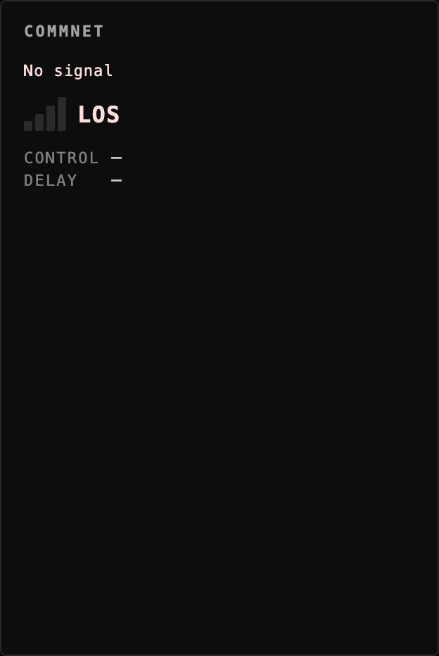
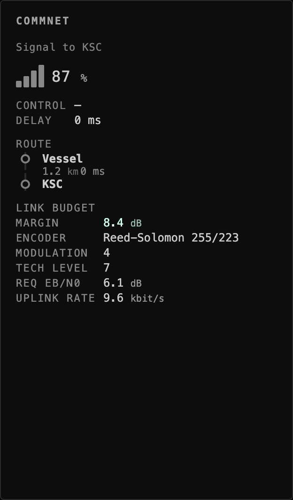
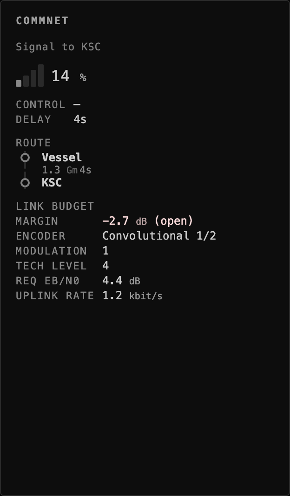
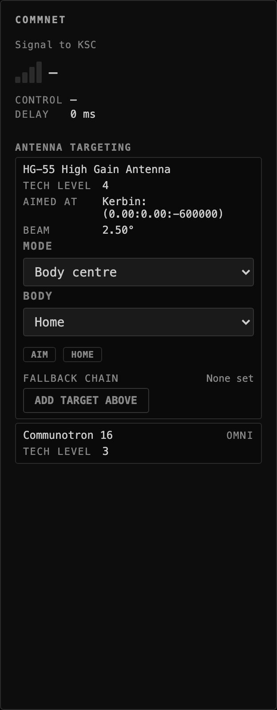
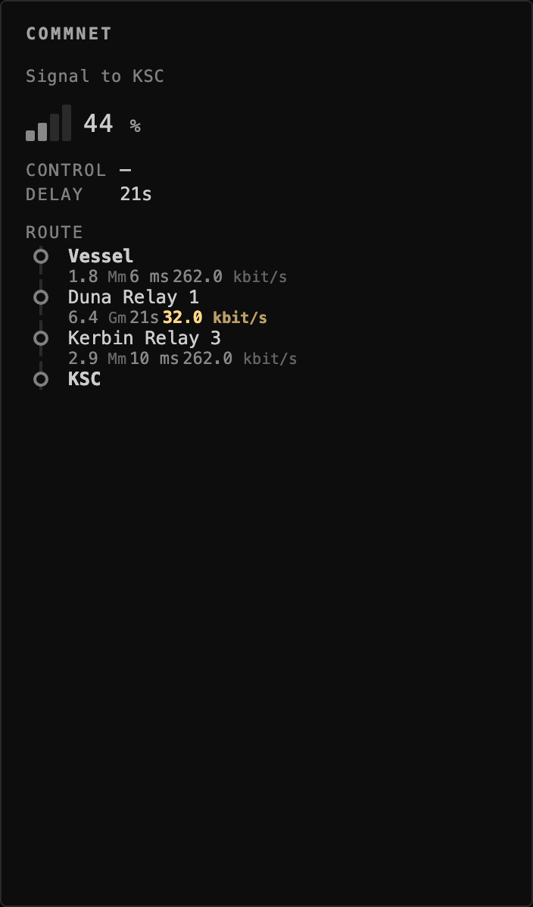

<!-- Generated by `gonogo-uplink docs`. Do not edit this file: it is written
     from the registrations, the contract slice and the fixtures. -->

# RealAntennas

Elects RealAntennas as the comms backend when it is installed, so the comms readouts carry RF link geometry, data rate and a re-derived link margin.

| | |
| --- | --- |
| Uplink id | `realantennas` |
| Version | `0.0.1` |
| Wraps | RealAntennas UNKNOWN (ckan) |
| Built against | contract 17.0, api 2.0.0, ui-kit 0.1.0 |

## Wire

| Topic | Payload | Delivery | Delay |
| --- | --- | --- | --- |
| `comms.dataRate` | `CommsDataRate` | lossy-latest | true-now |
| `comms.linkMargin` | `CommsLinkMargin` | lossy-latest | true-now |
| `comms.linkQuality` | `CommsLinkQuality` | lossy-latest | true-now |
| `realantennas.antennaChains` | `RealAntennasAntennaChain[]` | lossy-latest | delayed |
| `realantennas.antennas` | `RealAntennasAntennaState[]` | lossy-latest | delayed |
| `realantennas.hopRates` | `RealAntennasHopRate[]` | lossy-latest | true-now |
| `realantennas.available` | – | lossy-latest | true-now |

| Payload | Fields |
| --- | --- |
| `RealAntennasHopExt` | `band` text, `beamwidth` °, `codingRate` ratio, `encoder` text, `modulationBits` count, `powerDrawEc` units/s, `requiredEbN0` dB, `reverseBitsPerSec` bit/s, `techLevel` count |
| `RealAntennasTargetStep` | `altitude` m, `azimuth` °, `bodyName` text, `elevation` °, `forward` °, `latitude` °, `longitude` °, `mode` text, `vesselId` id |
| `RealAntennasTargetStepArgs` | `altitude` m, `azimuth` °, `bodyName` text, `elevation` °, `forward` °, `latitude` °, `longitude` °, `mode` text, `vesselId` id |

## Commands

| Command | Args | Result |
| --- | --- | --- |
| `realantennas.antenna.target` | `RealAntennasTargetArgs` | `CommandResult` |
| `realantennas.antenna.targetChain` | `RealAntennasTargetChainArgs` | `CommandResult` |
| `realantennas.antenna.targetHome` | `RealAntennasAntennaArgs` | `CommandResult` |

| Args | Fields |
| --- | --- |
| `RealAntennasAntennaArgs` | `antennaId` id |
| `RealAntennasTargetArgs` | `altitude` m, `antennaId` id, `azimuth` °, `bodyName` text, `elevation` °, `forward` °, `latitude` °, `longitude` °, `mode` text, `vesselId` id |
| `RealAntennasTargetChainArgs` | `antennaId` id, `settleSeconds` s, `steps` RealAntennasTargetStepArgs[] |

## Augments

| Augment | Into | Reads | Presence | Scenes | Notes |
| --- | --- | --- | --- | --- | --- |
| `realantennas-comm-signal-badge` | `comm-signal.badges` | `comms.dataRate`, `comms.path` | only while `realantennas` | 0 |  |
| `realantennas-comm-signal-section` | `comm-signal.sections` | `comms.linkMargin`, `comms.path` | only while `realantennas` | 3 |  |
| `realantennas-comm-signal-antenna-targets` | `comm-signal.sections` | `realantennas.antennas`, `realantennas.antennaChains`, `system.bodies`, `system.vessels` | only while `realantennas` | 1 |  |

## Contributions

| Contribution | Into | Computed from | Presence |
| --- | --- | --- | --- |
| `realantennas:comm-signal-hop-rates` | `comm-signal.hop-rates` | `realantennas.hopRates` | only while `realantennas` |

