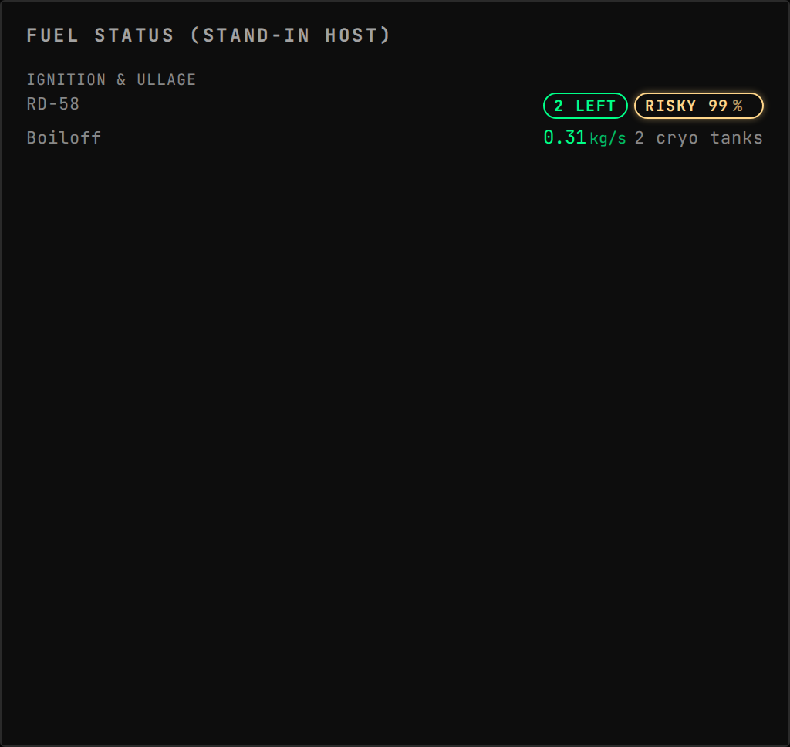
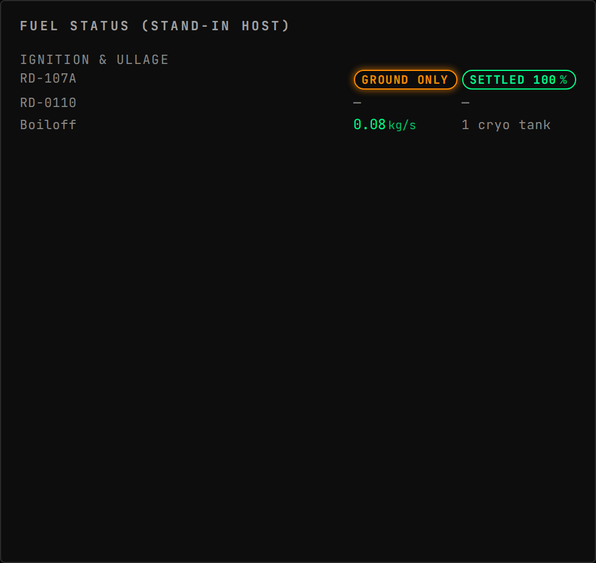
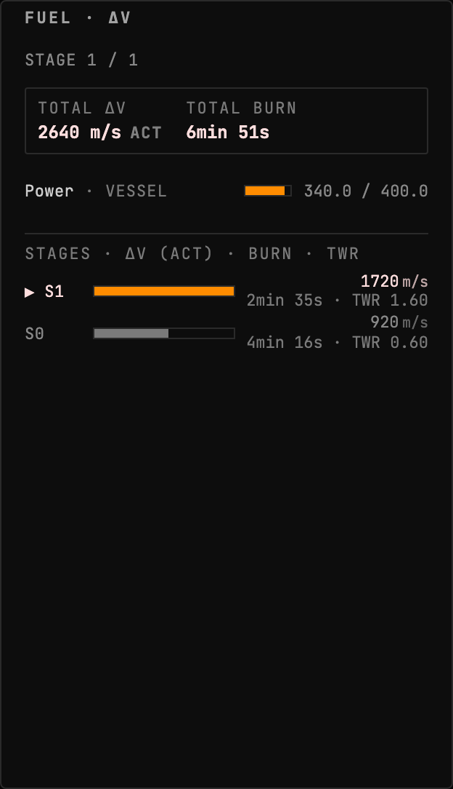
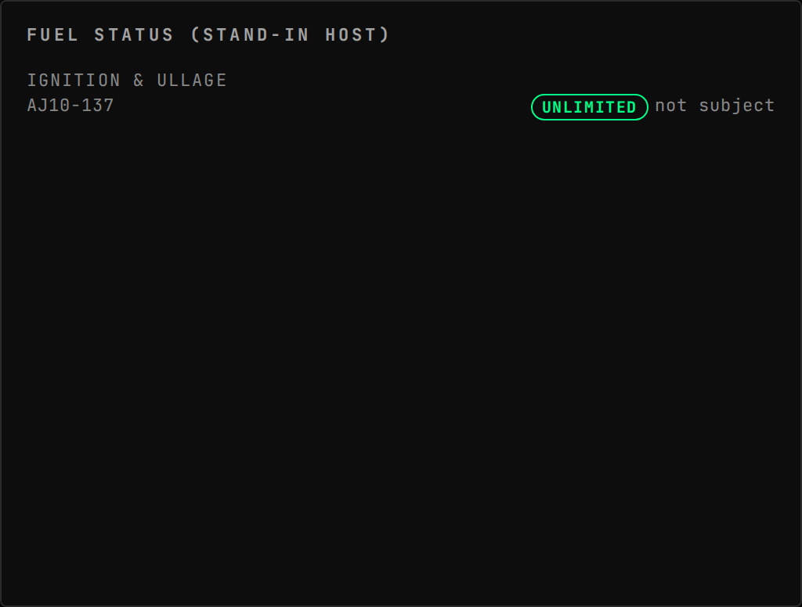

<!-- Generated by `gonogo-uplink docs`. Do not edit this file: it is written
     from the registrations, the contract slice and the fixtures. -->

# RealFuels

Reports per-engine RealFuels limits: ignitions remaining, ullage stability and pressure feed, plus cryogenic boiloff.

| | |
| --- | --- |
| Uplink id | `realfuels` |
| Version | `0.0.1` |
| Built against | contract 15.0, api 1.0.0, ui-kit 0.1.0 |

## Wire

| Topic | Payload | Delivery | Delay |
| --- | --- | --- | --- |
| `realfuels.boiloff` | `RealFuelsBoiloff` | lossy-latest | delayed |
| `realfuels.engines` | `RealFuelsEngines` | lossy-latest | delayed |
| `realfuels.available` | – | lossy-latest | true-now |

| Payload | Fields |
| --- | --- |
| `RealFuelsEngineEntry` | `feedPressureOk` flag, `groundIgnitionOnly` flag, `ignitionProbability` ratio, `ignitionsRemaining` count, `ignitionsUnlimited` flag, `literalZeroIgnitions` flag, `partId` id, `partName` text, `predictedMaximumResiduals` ratio, `pressureFed` flag, `ratedBurnTimeSeconds` s, `ratedContinuousBurnTimeSeconds` s, `ullageModelled` flag, `ullageStability` ratio |

## Augments

| Augment | Into | Reads | Presence | Scenes | Notes |
| --- | --- | --- | --- | --- | --- |
| `realfuels-fuel-status-section` | `fuel-status.sections` | `realfuels.engines`, `realfuels.boiloff` | only while `realfuels` | 4 |  |

