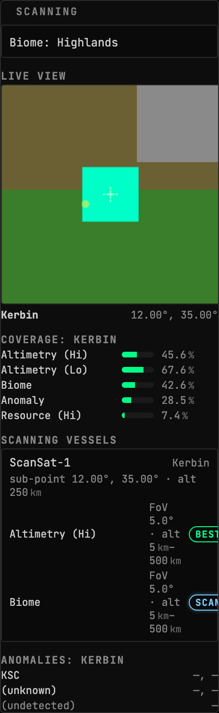
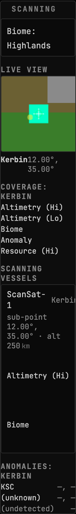
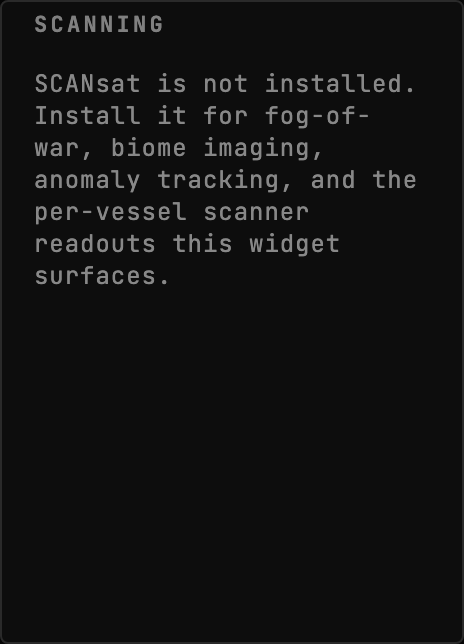

<!-- Generated by `gonogo-uplink docs`. Do not edit this file: edit
     `uplink.md` for the prose, and the registrations for everything else. -->

# SCANsat

Brings [SCANsat](https://github.com/S-C-A-N/SCANsat)'s orbital survey data onto the
mission-control dashboard: what has been scanned, by which craft, and where the
anomalies are.

SCANsat's own in-game windows are the authority on all of this. What this Uplink adds
is the part a second screen is for: the survey state visible continuously, beside
everything else, without pausing to open a map view.

## Install

Install SCANsat through CKAN as usual, then the Gonogo SCANsat Uplink alongside it.
Every surface here is presence-gated on SCANsat reporting in, so an install without
SCANsat shows one line saying so rather than a row of empty gauges.

| | |
| --- | --- |
| Uplink id | `scansat` |
| Version | `0.0.1` |
| Built against | contract 13.2, api 1.0.0, ui-kit 0.2.0 |

## Widgets

### Scanning

SCANsat status: per-scan-type coverage of the current body, the list of vessels SCANsat is tracking with their on-board scanners and live in-range state, and the body's known anomalies with discovery state.

- Widget id: `scanning`
- Needs: `scansat.available`, `scansat.scanningVessels`, `vessel.identity`, `system.bodies`, `vessel.surface`, `vessel.flight`
- Other mods may render into: `scanning.sections`
- Default size: 6 x 10 grid units

Coverage is per scan type and per body, because that is how SCANsat tracks it: a body
can be fully altimetry-mapped and completely unsurveyed for resources. The five rows
are the five types worth watching; the others exist on the wire and are noise on a
dashboard.

The live view is a window on the active craft's own sub-point, painted from the biome
colourmap and gated by the same coverage mask the map layers use, so an unscanned
patch is genuinely dark rather than guessed at. The cyan rectangle is the craft's
current ground track, at SCANsat's own field of view.

Anomalies are listed whether or not they have been identified: an undetected one still
tells you there is something on this body to find.

*Kerbin part-scanned: five scan types at different coverage, one satellite with sensors in range, and two known anomalies*

*Kerbin part-scanned: five scan types at different coverage, one satellite with sensors in range, and two known anomalies*

*SCANsat is not installed, so the widget says what it would show if it were*

## Sections added to other widgets

### `scansat:biome` into `map-view.base`

- Reads: none
- Only while present: `scansat`
- Suppresses the host's own default surface for that slot
- Adds settings to its host: `show (boolean)`

> No preview: no fixture names this augment. An augment that draws in its host's own coordinate space (a map projection, an SVG transform) cannot honestly be shown in a stand-in panel, which has nothing to draw against; one that renders ordinary content can gain a preview by adding a fixture.

### `scansat-science` into `experiments.actions`

- Reads: `scansat.science`
- Only while present: `scansat`

> No preview: no fixture names this augment. An augment that draws in its host's own coordinate space (a map projection, an SVG transform) cannot honestly be shown in a stand-in panel, which has nothing to draw against; one that renders ordinary content can gain a preview by adding a fixture.

### `scansat-footprint-overlay` into `map-view.overlay`

- Reads: none
- Only while present: `scansat`

> No preview: no fixture names this augment. An augment that draws in its host's own coordinate space (a map projection, an SVG transform) cannot honestly be shown in a stand-in panel, which has nothing to draw against; one that renders ordinary content can gain a preview by adding a fixture.

### `scansat-coverage-panel` into `map-view.sections`

- Reads: none
- Only while present: `scansat`

> No preview: no fixture names this augment. An augment that draws in its host's own coordinate space (a map projection, an SVG transform) cannot honestly be shown in a stand-in panel, which has nothing to draw against; one that renders ordinary content can gain a preview by adding a fixture.

### `scansat:altimetry` into `map-view.base`

- Reads: none
- Only while present: `scansat`
- Suppresses the host's own default surface for that slot
- Adds settings to its host: `show (boolean)`

> No preview: no fixture names this augment. An augment that draws in its host's own coordinate space (a map projection, an SVG transform) cannot honestly be shown in a stand-in panel, which has nothing to draw against; one that renders ordinary content can gain a preview by adding a fixture.

## What other mods can extend in this Uplink

Slots these widgets declare:

| Slot | Kind | In |
| --- | --- | --- |
| `scanning.sections` | section | Scanning |

On top of those, every widget above carries the framework's universal segments (`badges`, `filters`, `meters`), so another mod can add a badge, a filter or a meter to any of them without this Uplink declaring anything. They are not listed per widget: they are the floor every widget stands on, not this Uplink's own extension surface.

## What this page cannot tell you

- capabilities the mod half declares, which are registered imperatively
  rather than as a field, so nothing can enumerate them
- what a widget DOES, as opposed to what it reads. That is the one thing
  only its author can write, and `uplink.md` is where it goes

