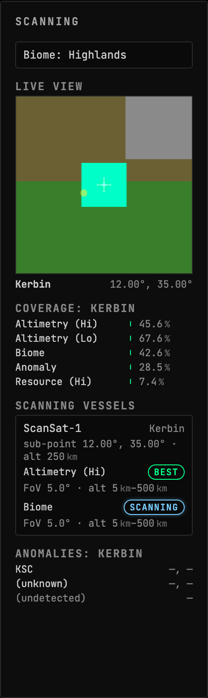
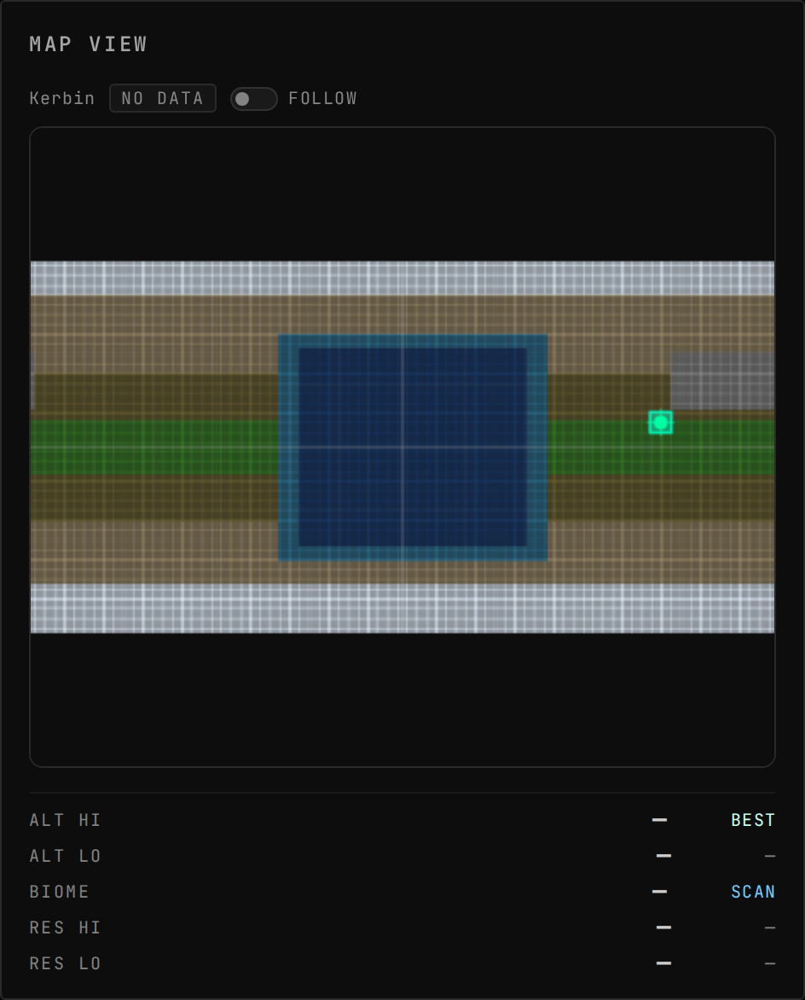
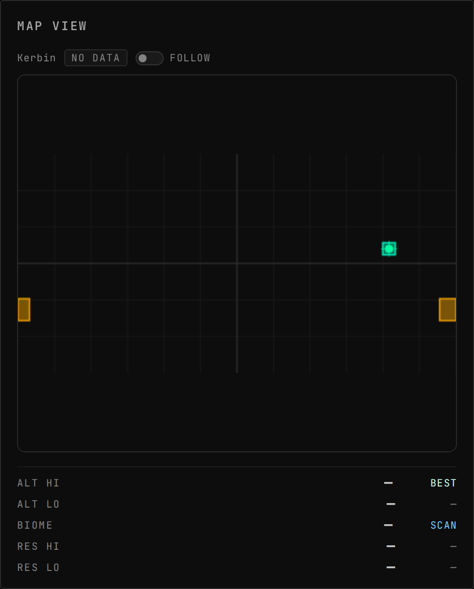
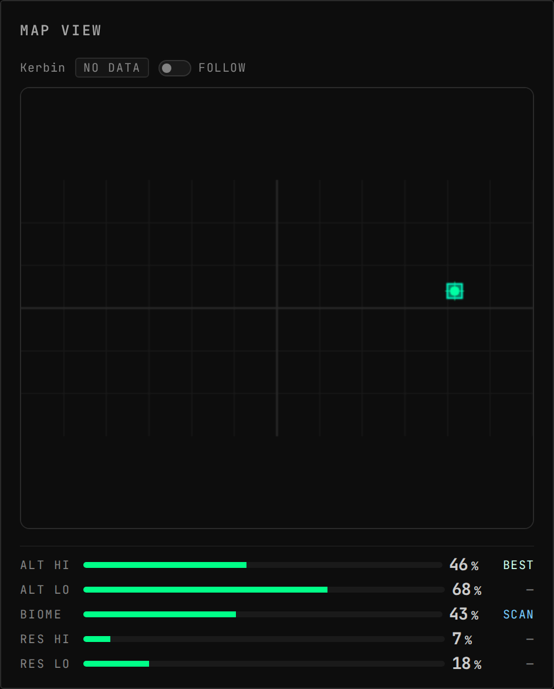
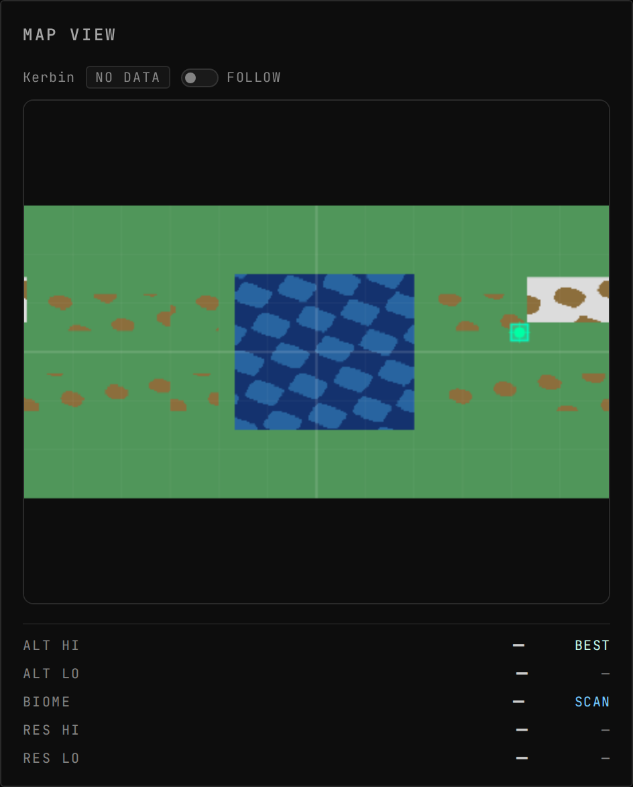

<!-- Generated by `gonogo-uplink docs`. Do not edit this file: it is written
     from the registrations, the contract slice and the fixtures. -->

# SCANsat

Brings [SCANsat](https://github.com/S-C-A-N/SCANsat)'s orbital survey data onto the mission-control dashboard: what has been scanned, by which craft, and where the anomalies are.

| | |
| --- | --- |
| Uplink id | `scansat` |
| Version | `0.0.1` |
| Wraps | SCANsat 20.4 (ckan) |
| Built against | contract 26.0, api 6.1.0, ui-kit 0.1.0 |

## Wire

| Topic | Payload | Delivery | Delay |
| --- | --- | --- | --- |
| `scansat.scanningVessels` | `ScanningVesselEntry[]` | lossy-latest | delayed |
| `scansat.science` | `ScanScienceEntry[]` | lossy-latest | delayed |
| `scansat.available` | – | lossy-latest | true-now |

| Payload | Fields |
| --- | --- |
| `ScanAnomalyEntry` | `detail` flag, `known` flag, `latitude` °, `longitude` °, `name` text |
| `ScanSensorEntry` | `bestAlt` m, `bestRange` flag, `fov` °, `inRange` flag, `maxAlt` m, `minAlt` m, `type` id |
| `ScanTrackColor` | `a` count, `b` count, `g` count, `r` count |

## Widgets

### Scanning

SCANsat status: per-scan-type coverage of the current body, the list of vessels SCANsat is tracking with their on-board scanners and live in-range state, and the body's known anomalies with discovery state.

| | |
| --- | --- |
| Widget id | `scanning` |
| Reads | `scansat.available`, `scansat.scanningVessels`, `vessel.identity`, `system.bodies`, `vessel.surface`, `vessel.flight` |
| Slots | `scanning.sections` |
| Default size | 6 × 10 |
| Scenes | 2 |

## Augments

| Augment | Into | Reads | Presence | Scenes | Notes |
| --- | --- | --- | --- | --- | --- |
| `scansat:biome` | `map-view.base` | – | only while `scansat` | 1 | replaces the host surface; adds `show` (boolean) |
| `scansat-footprint-overlay` | `map-view.overlay` | – | only while `scansat` | 1 |  |
| `scansat-coverage-panel` | `map-view.sections` | – | only while `scansat` | 1 |  |
| `scansat:altimetry` | `map-view.base` | – | only while `scansat` | 1 | replaces the host surface; adds `show` (boolean) |

## Contributions

| Contribution | Into | Computed from | Presence |
| --- | --- | --- | --- |
| `scansat:science-instruments` | `experiments.instruments` | `scansat.science` | only while `scansat` |

