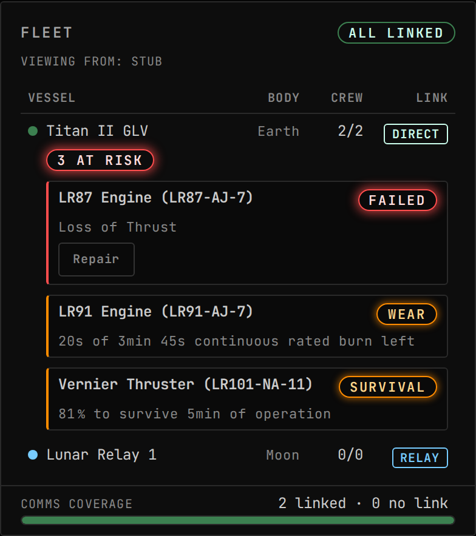

<!-- Generated by `uplink-tools docs` or `uplink-tools page`. Do not edit this file: it is written
     from the registrations, the contract slice and the fixtures. -->

# TestFlight

TestFlight engine reliability on the fleet roster: failed engines, rated burn nearly spent and survival odds, with TestFlight's own repair.

| | |
| --- | --- |
| Uplink id | `testflight` |
| Version | `0.0.1` |
| Wraps | TestFlight 2.12.0.0 (ckan) |
| Built against | contract 31.0, extension API 6.0.0 |

## Wire

| Topic | Payload | Delivery | Delay |
| --- | --- | --- | --- |
| `testflight.reliability` | `TestFlightReliabilitySummary` | lossy-latest | delayed |
| `testflight.reliabilityParts` | `TestFlightReliabilityPart[]` | lossy-latest | delayed |

| Payload | Fields |
| --- | --- |
| `TestFlightReliabilityBudget` | `consumed` ratio, `id` id, `kind` enum, `label` text, `limitSeconds` s, `usedSeconds` s |
| `TestFlightRepairOutcome` | `failuresCleared` count, `repaired` flag |

## Commands

| Command | Args | Result |
| --- | --- | --- |
| `testflight.repair` | `TestFlightRepairPartArgs` | `CommandResultOf<TestFlightRepairOutcome>` |

| Args | Fields |
| --- | --- |
| `TestFlightRepairPartArgs` | `partId` id |

## Augments

| Augment | Into | Reads | Presence | Scenes | Notes |
| --- | --- | --- | --- | --- | --- |
| `testflight-reliability-updates` | `fleet-roster.updates` | – | only while `testflight` | 2 |  |

## Error codes

| Code | Refines | Reads as | Meaning |
| --- | --- | --- | --- |
| `testflight.notModelled` | `modeUnavailable` | TestFlight is not reporting failures for that engine | TestFlight is installed and the reader could not reach its repair or failure-list members. |
| `testflight.noSuchPart` | `notFound` | no engine TestFlight is tracking has that id | No live TestFlight core aboard has that id. |
| `testflight.nothingFailed` | `notFound` | that engine has no active TestFlight failure | The engine is tracked and carries no active failure. |
| `testflight.unrepairable` | `capabilityMismatch` | TestFlight marks that failure as beyond repair | Every active failure on the engine is a class TestFlight says no repair can fix: an explosion, a fired docking clamp, a snapped solar mechanism. |
| `testflight.repairDeclined` | `modeUnavailable` | TestFlight left the failure standing | TestFlight was asked to repair and left the failure standing without saying why. |

